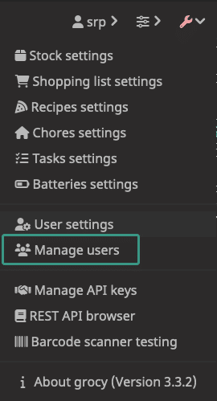

+++
date = 2023-05-23T17:10:24.000Z
lastmod = 2025-09-23T03:05:44.000Z
title = "Setting up Grocy on Caddy with Let's Encrypt Support"
draft = false
slug = 'setting-up-grocy-on-caddy-with-lets-encrypt-support'
t = ['Self-Hosting']
cover = '/2dc686e5-4e6b-40c1-b6a0-7929e2cd6abc_1024x682.png'
summary = "My wife loves organization and asked for a system to manage grocery inventory management. As the husband sysadmin, it is my sworn duty to oblige (after all, it's lots of fun!)."
+++

My wife loves organization and asked for a system to manage grocery inventory management. As the husband sysadmin, it is my sworn duty to oblige (after all, it's lots of fun!). However, I learned there's no Grocy setup guides with Caddy. This guide seeks to help those who were in my shoes and be quite reproducible.

If you encounter any issues, please leave a comment or shoot me an email (which you can find in [my About page](/about/)).

## System requirements

I'm running this on a Vultr server for $4.20/mo. If you don't use Vultr and are interested, consider using [this referral link](https://www.vultr.com/?ref=9350311-8H), which may not last very long but [there's another of mine you can use also](https://www.vultr.com/?ref=9350310). My box has the following configuration:

- Cloud Compute (Shared vCPU)
- Intel Regular Performance
- 1 vCPU
- 512MB Memory
- 10GB SSD
- 0.5TB Bandwidth
- IPv4 Enabled (so the $3.50/mo. tier)
- Debian 11 (Bullseye)

I recommend enabling their "Auto Backups" option as Grocy runs on an SQLite database in the filesystem. This costs an extra 70 cents a month, which you might be able to save if you're mindful to keep backups offline, in Google/iCloud Drive, Dropbox, or some other cloud/web option.

This guide assumes that you have some sort of user with `sudo` access (that isn't root) to do this work from, it also assumes that you have a domain/subdomain pointed to your server in an A record. As a habit, I disable root logins and use SSH keys for authentication to my servers.

## Setting up prereqs

Make sure your system is up to date using `sudo apt update && sudo apt upgrade`. Vultr's install out of the box will make this unnecessary, but you might get a petition to `sudo apt autoremove` an unused `linux-image` package that the install makes obsolete.

To start, make sure port 80 and 443 are open to the world like so:

```sh
sudo ufw allow 80
sudo ufw allow 443
```
#### Caddy Installation

We're following the [official advice from Caddy's documentation](https://caddyserver.com/docs/install#debian-ubuntu-raspbian). Please check that these commands are the same in case Caddy updates something on their end.

```sh
sudo apt install -y debian-keyring debian-archive-keyring apt-transport-https
curl -fsSL 'https://dl.cloudsmith.io/public/caddy/stable/gpg.key' | sudo gpg --dearmor -o /usr/share/keyrings/caddy-stable-archive-keyring.gpg
curl -fsSL 'https://dl.cloudsmith.io/public/caddy/stable/debian.deb.txt' | sudo tee /etc/apt/sources.list.d/caddy-stable.list
sudo apt update
sudo apt install caddy
```

Additionally, you'll need to run `setcap` on the Caddy binary so that it can use these ports without having to run as superuser, since Caddy runs on its own user:

```sh
sudo setcap 'cap_net_bind_service=+ep' /usr/bin/caddy
```

We'll set up our Caddyfile later.

#### PHP-FPM Installation

This gets a little goofy since Debian does not package PHP 8.1 in official repositories (only 7.4 is available as of writing). However, the maintainer of the PHP packages has a repository to install other versions.

```sh
echo "deb https://packages.sury.org/php/ $(lsb_release -sc) main" | sudo tee /etc/apt/sources.list.d/php.list
curl -fsSL https://packages.sury.org/php/apt.gpg | sudo gpg --dearmor -o /etc/apt/trusted.gpg.d/php.gpg
sudo apt update
sudo apt install php8.1-fpm php8.1-sqlite3 php8.1-gd php8.1-intl php8.1-mbstring
```

We then need to configure PHP-FPM to pay attention to Caddy as opposed to the generic Nginx/Apache "www-data". Open `/etc/php/8.1/fpm/pool.d/www.conf` in your favorite terminal text editor.

On line 28 and 29 (as of writing), you should see the following:

```ini
user = www-data
group = www-data
```

You'll want to replace "www-data" with "caddy," like so:

```ini
user = caddy
group = caddy
```

We'll do something similar with lines 53 and 54, which should be written to look like:

```ini
listen.owner = caddy
listen.group = caddy
```

At this point, we can enable more clear logging of errors to help with troubleshooting. You can ignore this if you trust the guide to be exactly what's needed, but I recommend it in case any issues come up.

Go to line 411 and enable worker output collection (which goes into /dev/null if disabled):

```ini
catch_workers_output = yes
```

At the bottom of the file, on lines 466 to 468, you'll need to do some uncommenting and modifications so that these are what you see:

```ini
php_flag[display_errors] = on
php_admin_value[error_log] = /var/log/php-fpm.www.log
php_admin_flag[log_errors] = on
```

Finally, create the file and set its permissions so that PHP-FPM can write to it:

```sh
sudo touch /var/log/php-fpm.www.log
sudo chmod 666 /var/log/php-fpm.www.log
```

Lastly, update the `php8.1-fpm` service to have read/write permission in the Caddy webroot folder:

```systemd
[Service]
ReadWritePaths = /usr/share/caddy
```

Restart PHP-FPM with `sudo systemctl restart php8.1-fpm`.

## Setting up Grocy

As of writing, the current release is v3.3.2. Please check [the project's GitHub](https://github.com/grocy/grocy/releases) for any newer releases. We'll want to use the zip file so that we don't have to manage dependencies ourselves.

```sh
cd /usr/share/caddy
sudo curl -kLO https://github.com/grocy/grocy/releases/download/v3.3.2/grocy_3.3.2.zip
sudo unzip grocy_3.3.2.zip
sudo rm grocy_3.3.2.zip
```

As a preference, I keep a backup of `config-dist.php` as it may change in later versions, so I can easily compare with any new items in there.

```sh
sudo cp config-dist.php config-dist.php.bak
```

We'll copy over the default configuration file to the data directory. You can edit defaults around if you like, but there was nothing notable that I found necessary to change.

```sh
sudo cp config-dist.php data/config.php
```

It's **very important** that you do not delete `config-dist.php`. Grocy will complain if it does not exist.

Finally, we'll want to set permissions on the `data` directory in order for it to be writable. This is where Grocy's database and cache is stored:

```sh
sudo chmod -R 755 data
```

## Writing the Caddyfile

This is where the process becomes pretty easy. Open up `/etc/caddy/Caddyfile` in your favorite text editor. You'll want it to look like the following:

```caddy
{
    admin off # disable Caddy's admin panel
    http_port 80
    https_port 443
}
    
grocy.example.com {
    tls email@example.com

    file_server # serve static files
    root * /usr/share/caddy/public

    try_files {path} /index.php?{query} # url rewriting

    @php path *.php # any php file in /usr/share/caddy/public
    php_fastcgi @php unix//run/php/php-fpm.sock # use php-fpm for any php file

    encode gzip # compress responses for speed
}
```

Replace `grocy.example.com` with your domain and `email@example.com` with your email, which is used by Let's Encrypt to warn you if your cert is expiring. Caddy will automatically renew your certificates, so this really is only used if you stopped using this domain with Let's Encrypt. Caddy also automatically elevates requests to a TLS connection, so no special configuration needed for automatic HTTPS redirect!

We'll restart Caddy to use our new changes:

```sh
sudo systemctl restart caddy
```
## Voilà!

You should have Grocy running at `https://grocy.example.com` (or whatever your domain is). You'll now need to login with the default user `admin` with the password `admin`. You should change this username and password immediately in the Manage Users settings.


