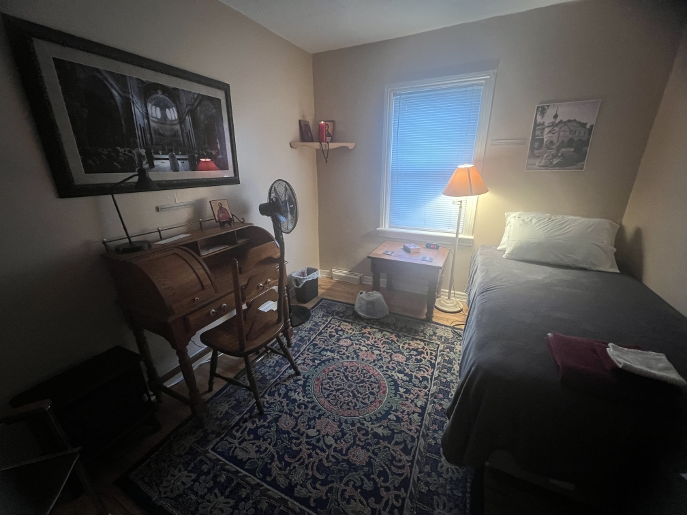
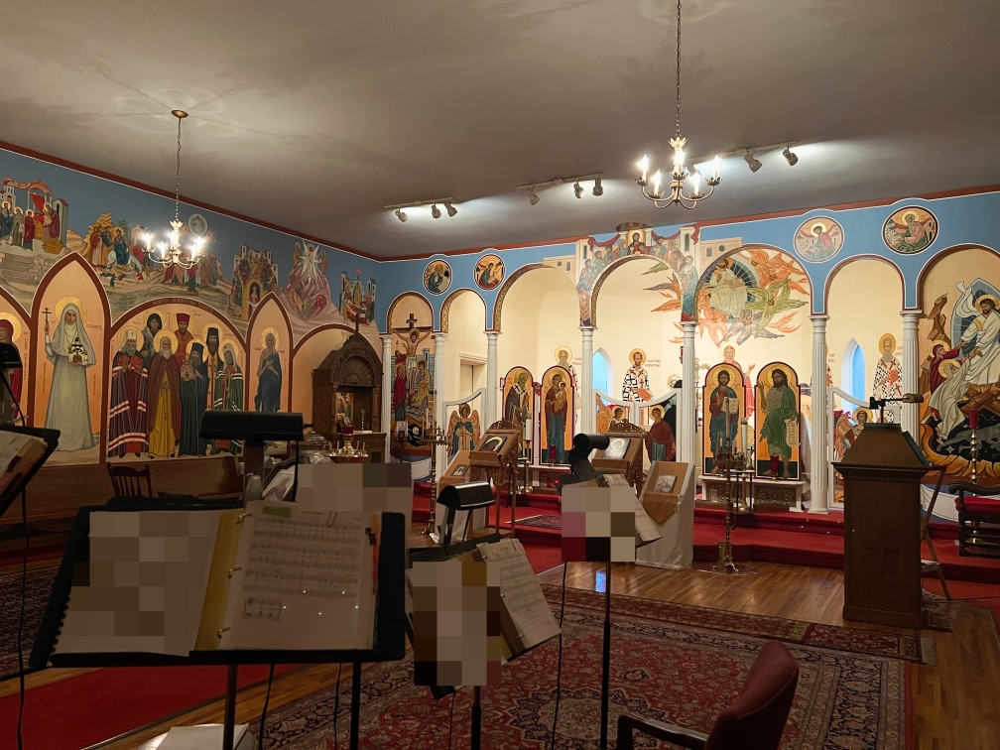
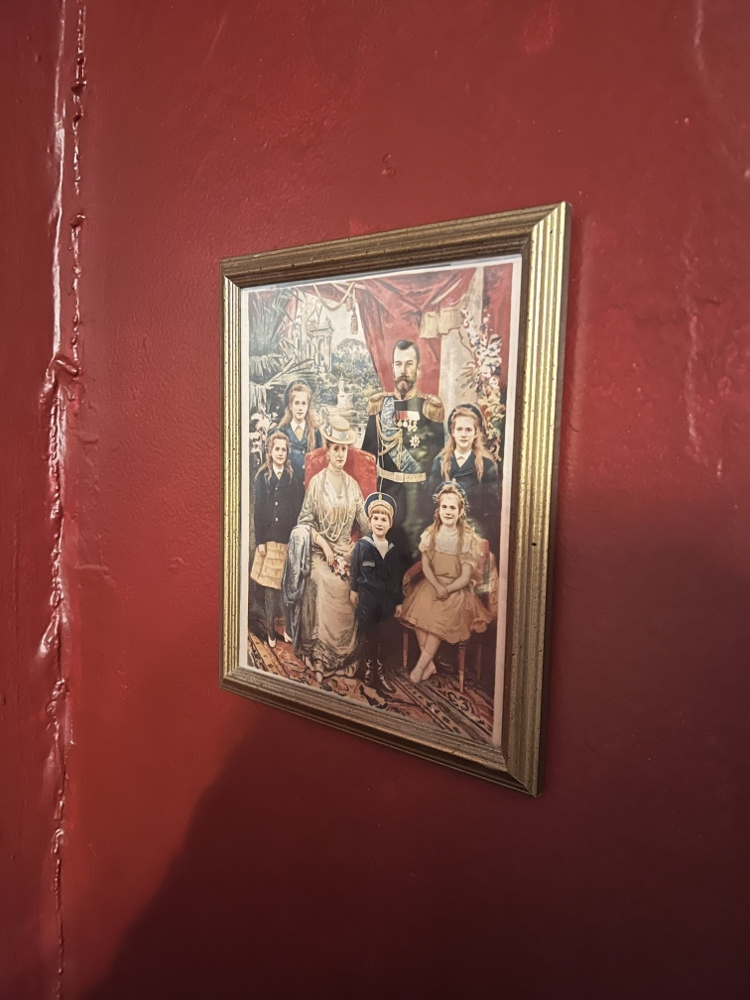
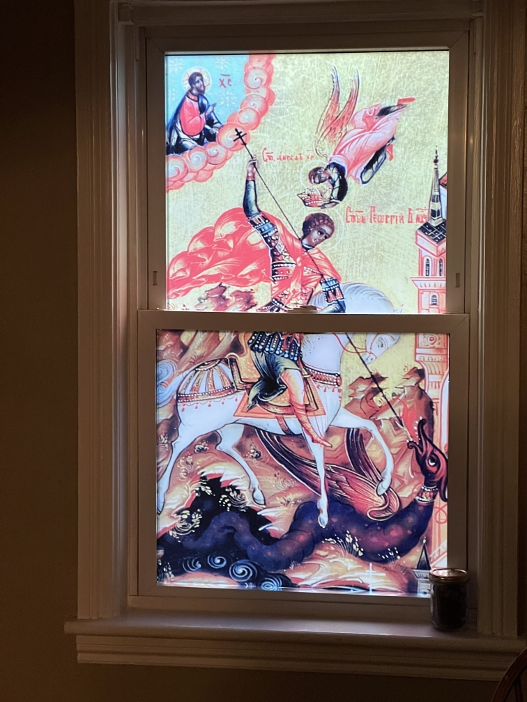
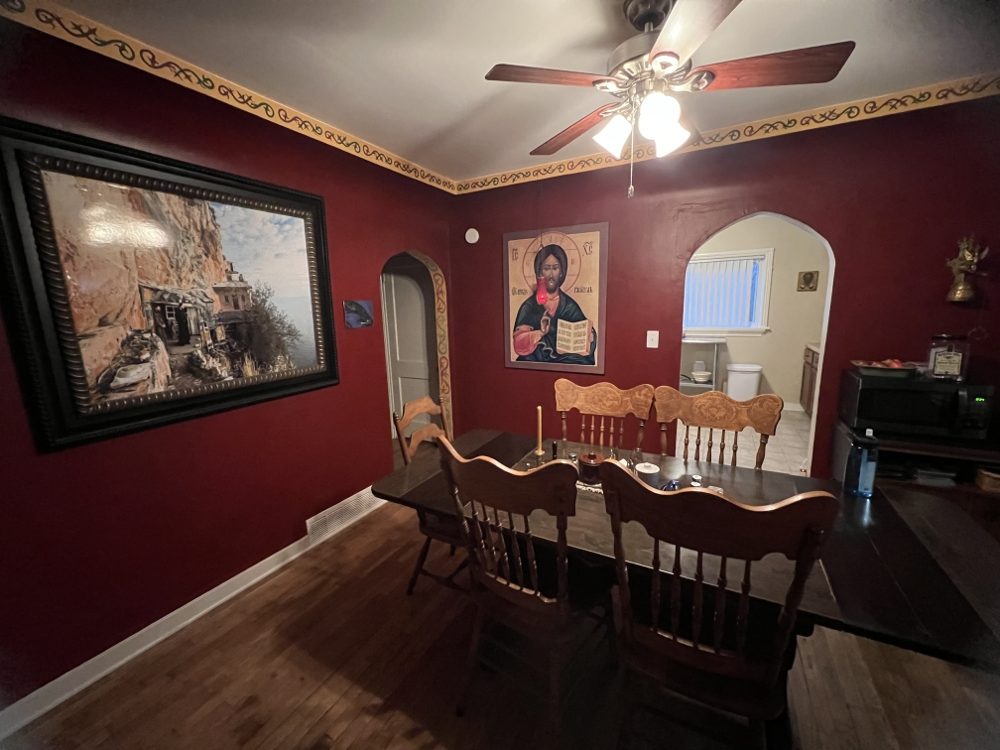
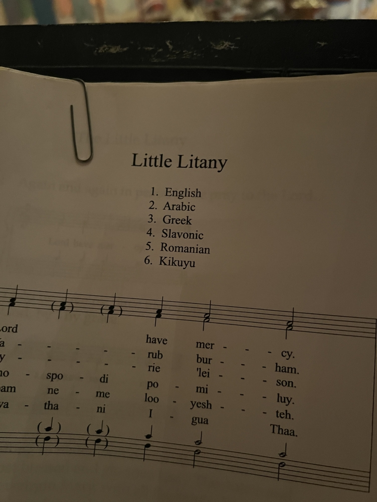

### Preface

This post begins a series chronicling my week-long personal retreat at a local hermitage in the last week of January leading into February. These writings were made daily during the retreat, typically in the evenings but as the week went on I would write a bit in the mornings and afternoons too.

As for the methodology of these posts: I intend on releasing these over the week in relative batches, merging posts for days that did not have much content on their own. All names have been anonymized to maintain the privacy of the monastics, given that I'm under an interdict to basically not publicize them. Thus, any photos I have, people and potentially identifying elements are obscured. Finally, these writings are not necessarily the raw text. I intend on releasing them with little editing (mainly grammatical/typographical), but with some additions to provide context or finish thoughts where missing (either in pull quotes or italics). I have no intention of redacting anything beyond names and locations.

### Day 1 - Saturday

*Context: I arrived around 4pm, an hour before their vespers service. This was the time I had arranged with the superior. Vespers and divine liturgies are typically done at a nearby parish down the street, as the hermitage does not have ordained clergy.*

The trip was somewhat plain, I had taken a rural route that added 10 minutes but it was a better pace than the highway, *I saw some cows*; in the nearly 5 hours I’ve been here (it’s 8:40pm now), much grace has been given.

I was greeted by one of the novices, Br. Herman, who welcomed me into the guesthouse and showed me my room and a simple tour of the house I was staying in. He served me tea and we chatted as he was processing a massive butternut squash into ziploc bags as a soup base. We were both pleasantly surprised to discover that we’re both from Port Huron. He was one of the workers involved in the demolition of [the DTE coal plant](https://en.wikipedia.org/wiki/Marysville_Power_Plant) just south of it. This provided a thing for us to bond over, given that we’ve both spent a lot of time there. Not long after he went over to the church to prepare for vespers, I took up some reading and he came back about a half hour later to walk me over for ninth hour and vespers.

The service was nice, a decent portion of the music is familiar and I can join in easily enough. The only caveat is having to use my brain a bit more when joining in. Fr. Ignatius *(the superior of the hermitage, a Rassophore monk, also the choir director of their parish)* doesn’t key everyone a lot of the time, and so I have to rely on what I’ve inferred over the year and a half to work out what note I’m starting from. It’s the same bike, but not with the training wheels that my parish's choir directors provide all of us.

In the augmented litany of vespers, they mentioned me as a little visitor category. I don’t know if they’ll do that for all the services while I’m here *(they didn't)* but it caught me off guard. Speaking of litanies, this parish has two deacons, and one of them is a native African. He greeted me when he arrived. I was also greeted before the service by the other novice, Br. Michael, the oldest of the three but very kind. Once the service was over, Fr. Kentigern *(the parish priest) *apparently gives small homilies after. They’re in this series of explaining the architecture of the church and its symbolism.

After all was done, we headed back to the guesthouse to prepare for dinner. I got to give a bit of my life story to Br. Michael and we had some light conversation while we waited for Fr. Ignatius to bring dinner (Little Caesar’s for the special occasion). Michael had pointed out my watch *(an Apple Watch)* and I explained why I used it and what neat things it could do. They were both quite astonished at the technology, which was endearing really.

*Context: Br. Michael is in his late 60s, the other two are in their 50s.*

Fr. Ignatius arrived with pizza, spoke a bit to me about the rough game plan for tomorrow and left. He’s been very hospitable but he’s been fairly busy today. The pizza was actually really good, the brothers have a practice of just adding a bunch of toppings of their own to it*, like artificial bacon bits and parmesan cheese*. I can attest firsthand that you can actually make Little Caesar’s better.

Br. Michael left shortly after eating, so Herman and I chatted some more. I asked him about how he got into Orthodoxy (considering it’s virtually unknown where we’re from). His life story went a bit like this: he was in the trades for his 20s and some of his 30s. He got diagnosed with arthritis and decided to get into truck driving. After some time, his kids told him he needed to find a significant other and he did. Both of them would travel together going around everywhere. One day at home they had a fight about tidiness. He left in a huff and shortly after his boss has him do an emergency delivery down to Alabama. *As he was beginning to return to Michigan,* he got a call from someone that his SO was in the hospital. She was at a friend’s and had tripped and cut her head, and she wasn’t going to make it given the blood loss. As fast as a semi truck could go, Herman was not quick enough - his fiancée passed away, they were planning to marry later that year.

Herman got into a very dark place and used habits to nullify the hurt. He ended up in the [redacted] area, going to a [volunteer-ran rehab center]. He had met a friend who attended the local parish and would become his sponsor for conversion into the Church *(mere days before my own chrismation, no less)*. Herman would go on to get back into building, and was commissioned to help build some stairs and flooring for the guesthouse I’m in now. But inviting him to the monastery for him was a trap that he was eager to fall into, and since then *(about 2 years ago)* he’s been here.

After the chat, we said a prayer in thankfulness for the meal. He cleaned up a bit, I helped where he would welcome it, and I’m back in my little cell. He left not too long ago, and as the only guest I’m alone here. I suppose that’s a good thing, a lowered amount of distraction. I’m going to end my day with my typical daily reads, say my prayer rule and go to sleep.

### Day 2 - Sunday

Today went well, albeit much slower. It will pick up for the rest of the week, so much that it makes sense why they take so much rest on Sundays.

I woke up at 7, a half hour before my alarm. I tossed and turned a good bit during the night but my sleep tracking says I slept well. I remember waking up even for a brief moment in those instances, not sure what to believe.

Matins and liturgy went well. Their service is interesting. It’s an Antiochian parish but we mostly use Slavic liturgics. I got to chant in matins and sing in liturgy. Their music is mostly familiar but sometimes the key they use is slightly different. I believe I stood next to a basso profundo, he arrived late but he struck me as someone who could hit that range given the opportunity.

The notable differences in the liturgy were the plain reading of the prokeimena with no repeat or response from the choir. They virtually skip the augmented litany and the litanies of the catechumens and faithful, going straight into the cherubic hymn after the homily. There was also a very notable pause between communion ending and the start of “we have received the true light.”

I learned more about the African deacon. They actually sing a Lord, have mercy response in his native language of Kikuyu. A brief Wikipedia search tells me he’s Kenyan. It’s very cool to see in person the fruit of Orthodoxy’s work in Africa. I’ve only seen articles and short videos.

Afterwards they hold a small coffee hour and then the monks depart. A lot of the laity stay for longer. Fr. Ignatius doesn’t leave until much later as he helps clean up and assist people with certain things. I was able to buy a couple of books, St. Sophrony’s “On Prayer” and a copy of the HTM Prayer Book. The latter was more of a curiosity and in hindsight maybe I shouldn’t have got it, but I’ll work out how to incorporate it. I learned also that the storage unit we’re clearing out in Toledo contains items from Fr. [redacted]’s closed parish in [redacted], not from St. George Cathedral like I thought.

The rest of the day was relatively indifferent. I spent a portion of time reading. I got tired of it so I said the Jesus prayer for some time which I found good. I asked Fr. Gabriel *(my father confessor)* for some advice on how to manage these moments of relative boredom but I’m not sure if it’ll be practical given that I’ll be quite busy for the rest of the week now.

The monks arrived along with Fr. Ignatius and we had a snack of crackers, cheese, and salsa. I was able to talk more with Fr. Ignatius compared to the retreat thus far, in a way recapping a lot of my conversations with the novices last night. He gave us an overview of our plans for the week and left once more. I learned too that he sleeps in this guesthouse. I was wondering why I had heard footsteps last night, since the monks stay at the hermitage, but it seems that Fr. Ignatius has a room here for one reason or another.

Anyway, after he left we cleaned up. Br. Michael left shortly after. Herman looked at him a bit longingly as he left, once he did he explained to me that *Michael's* mother was in poor health and he got some news earlier today that seemed to suggest her repose was near. Herman and I spoke for a bit on different things: grief, keeping occupied, the usefulness of community, so on, but it was getting late so he left.

I did my usual evening routine and I was able to somewhat welcome Fr. Ignatius home as he arrived again. We said our “goodnight”s and now I’m here writing this. It’s just shy of 9:30, which means 7 and a half hours of bedtime available *(we'd be waking up at 5am for the next few days)*. Good night.

