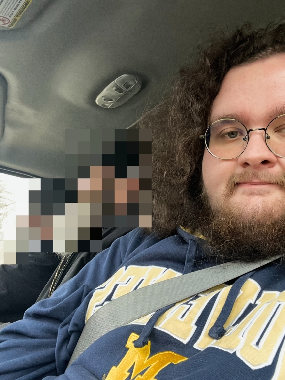
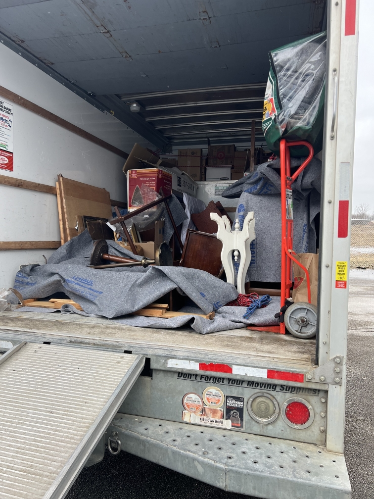
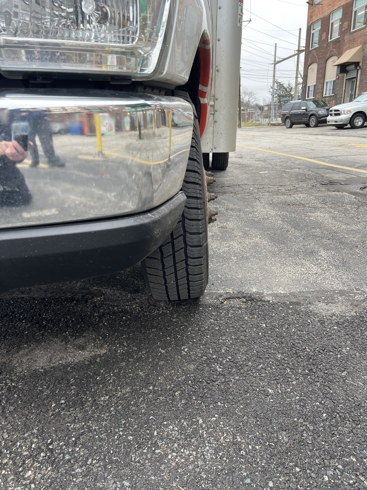

I woke up to my alarm. I slept less but the quality was apparently better. I didn’t wake up from tossing and turning as much, although since being here I’ve had leg cramps every night. I’m not sure if there is a purpose to them or why they’re happening more so than usual.

Matins was good, I was able to participate quite a bit in it and I enjoyed it all. Part of what I am trying to do here is figure out what my crosses are that I have to carry, internally that is. Attentiveness is a big one, but the other one is deferring to God’s will. [The Prologue reading](https://web.archive.org/web/20240810233440/https://www.ohrid-prolog.com/index.php?lang=en&prayer_date=2024-02-11) *(specifically the homily)* helped me to realize this. I don’t do God’s will. In fact, I hardly ever think about it beyond mere theory. And as this thought came to my mind, not soon after did one follow trying to justify myself for my failure. “What are you meant to do? You don’t know! How could this be held against you when you’re simply dumb and inattentive?” While I may struggle with attentiveness, I still need to focus more on what God wants in the situations of my life. I don’t think about that, which is not ignorance that I can just pretend is no big deal. While my body may dispose me to be inattentive*, being diagnosed with ADHD*, it’s no excuse for me to be attentive to things that entertain me and not to the things that will save me. So thus begins a new field of study, working out within myself how God wants me to be and what He wants me to do. As I seek to find ways to work around myself to be attentive to spiritual matters, I need to pay special attention to this element of it - for it is this element that I fulfill Christ’s commandments and truly unite myself with Him. May He send His grace upon me to guide me in all things.

Afterwards, Fr. Ignatius gave me a tour of the hermitage and showed me the barn they’re converting into a chapel. It’s quite bare still, and they’re waiting on their builder to bring over more steel. It seems that they’re in similar circumstances to our own parish back when we were in the middle of remodeling.

We returned back to the guesthouse. Fr. Ignatius left once more but Br. Michael and I had breakfast together - with the quintessential American Orthodox fasting food no less *(that is, PB+J sandwiches)*. He left, we were on rest until we were leaving for Toledo.

Some time passed and Fr. Ignatius collected me in the U-Haul. We quickly picked up Br. Michael around the corner and off we went. I made the very poor judgment call of not using the bathroom before I left and in even greater foolishness I held on as long as I could. We got as far as Milan when we stopped so I could take a bathroom break. Once done, we went back on the road.

We arrived in Toledo about 30 minutes after and headed straight for the storage unit. We parked and headed in to see what we were working with. It was fairly full, there looked like what maybe was an altar, along with some lecterns/icon stands, some icons from old [name of saint church] in [redacted]’s iconostasis, candle stands, so on. Within 1-1.5 hours we worked through it, organizing as we continued on and packed everything neatly. I know there’s a lot of sanctity to the treatment of icons, but I didn’t realize how far this should go - even though Fr. Ignatius wasn’t a fan of the stylistic choices made in a lot of them, he took great reverence toward them, requiring blankets be placed so they didn’t touch the cargo floor.

Once all was packed, we went around the corner to a Circle K. Thus begins more of Fr. Ignatius’ generosity. He allowed me to buy whatever I liked, making sure to get bottles of water for everyone who wanted one. I bought two pretzels, and exchanged one for one of the PBJs Michael brought with him. We had our short lunch of sorts and then we headed to Vladyka’s house, about 10 minutes away. He lives in a dense residential area but it’s nice, it reminds me of my godparents’ old neighborhood. We were greeted by Fr. Matthew *(the priest of our sister parish in our county, secretary of our diocese)* when we came in, he was surprised to see me like I had hoped - I knew he would be there but I didn’t know if he would’ve thought I was in Fenton, because usually I drop off Anna at knitting club *at his parish*. Vladyka blessed us all individually and the monks showed him the things they brought for him. Fr. Ignatius’ mother had restored (reproduced?) an icon that he really liked, and Br. Herman made some sauerkraut from some cabbage that someone donated to the hermitage (we delivered it on his behalf). Vladyka’s eyes lit up when we mentioned the sauerkraut.

Seeing him in this environment was humbling and helpful. I realize more that he’s not so much an antisocial person… it’s more just that he’s an old fella. Things seem to happen slower at his home, and maybe in the parish setting he’s just looking to get things done so he can relax. He’s got a lot on his plate, after all.

Afterwards the monks showed me the chapel they built in his house, which was really impressive. Unfortunately, I didn’t take a photo, but I’m sure I could source one if I asked.

*Context: I did indeed ask, but I was told I couldn’t share it online, so I didn’t have anyone send me a photo.*

Fr. Matthew spoke with Fr. Ignatius a bit after, which helped illuminate the humility a bit more. Fr. Matthew was sharing how Vladyka was very thankful for the chapel and how they’ve been able to use it for about a year now. It struck me more that Vladyka has a lot of depth of love for God and his flock, but it gets obscured by the logistics and physical efforts that a person his age just isn’t so fond of.

It was a good experience, and we left shortly after. We had another bathroom break then began heading back home.

When we got on the highway, everything seemed mostly fine but Fr. Ignatius was mentioning how the steering wheel was jerking around a bit and the brakes felt soft. It bothered him so we headed for the nearest off-ramp. As we got onto it, we started hearing an awful grinding sound on the left hand side. Conveniently, the “DEVILBISS COMMUNITY SCHOOL” (it was actually “DeVilbiss Community School” but the sign made little effort to put lowercase in) was available for us to stop at. We got out and checked the wheels, Fr. Ignatius had us stay outside and watch each side to see if anything seemed off. I noticed that the front drivers-side wheel was a bit crooked, leaning inward. I asked Br. Michael if my judgment was right and he agreed. Ignatius pulled around the school and we got back in. We decided to go to the nearest U-Haul location to see if we could get it sorted out. This was around 3:20pm.

On the way there, many awful noises were made with this truck. The grinding was one thing, but then there was squeaking, and as we hit even small bumps it would sound brutal. After much wincing, we arrived at the center about 5 minutes away from where we were. *I've never cringed more at the sound of a vehicle.*

Fr. Ignatius walked in and asked the staff what can be done and they gave him a hotline to call. After about 20 minutes or so, someone picks up and Ignatius goes over everything that’s happened. After some logistics with the request and taking some photos, they sent some roadside assistance to scope it out. We waited another 20 minutes for his arrival, and to our surprise he arrived but with his wife and kids in the car - Ignatius asked why, turns out they just wanna tag along sometimes. Anywho, our roadside assistant test-drives the truck a couple times. Comes back, tells Ignatius how awful it sounded. He props the front with a jack and shows us what went wrong. The whole brake pad became very loose, and after some insight from Br. Herman over text, it was an issue maybe with the wheel bearing. Attached below is a video of the assistant being able to freely move the tire which is meant to be totally connected. He was able to tighten it up quite a bit, but he wasn’t the one who could make the judgment call on the next step forward. We were all skeptical about continuing onward in the same truck - what if it happened again? What if the next time was worse?

Our assistant tells us he has to call it in to his superiors and then someone will follow up with us, telling us that we’d get another truck to swap into. It felt like it took about another 45 minutes to an hour (mind you an hour+ had already passed by this point) after that.

During that time, a man came into the center dressed a bit more stylistically than most, in inner-city street style. He made an interesting greeting toward Fr. Ignatius. He seemed to recognize he was a monk, he made a sort of prayerish bow. Father made a remark about how he too was wearing black like them. The man was a bit puzzled and thought he was referring to skin color, so he replied multiple times “there is no color.” Father didn’t clarify himself. He moved onward, asked the clerk about their propane refills. The clerk said their little propane system was down and he had this somewhat dramatic (in a melodrama sort of way) response about it. I was sitting on the floor since there wasn’t any seats, and as he turned the corner back to us (we were by the entrance) he made some remark about kneeling and got down on a knee to pray… about his propane? He didn’t say anything during it. Once he was done, he got up and made some compliment that he respected the monks or something like that and gave them all fistbumps. He came up to me and did the same and I made a dumb remark about him doing that despite me wearing Michigan colors. He didn’t seem to catch on and I didn’t want to dig things further. He made a remark about how we’re in one universe and then left. I debated including this, since I don’t want to cast judgment. I mention it however because I know that God sends certain people for certain purposes, and I’m not really sure what this purpose was.

I had made a similar remark to the monks, wondering about what “moral of the story” we were meant to get from God *(about the whole dilemma)*. I was unsure since I’ve become kinda accustomed to these things happening, and of course not everything can be so straightforward. Fr. Ignatius said it was patience, given the time it’s taken between waiting for someone to look at it, to the time it took for that someone to look at it, to the time it took for someone to tell us what’s happening next. Br. Michael said it was relying on your gut, referring to Ignatius making the call to get off the highway. I’m not sure who is more right, or if there’s any other ones. It’s too late to think about.

After the time passed we finally got a call from the customer service rep that was assisting us through it all. She told us we were getting another truck but sourcing one was a bit odd. For some reason they didn’t think about just taking one from the center we were at. After some back and forth they were able to arrange that, but another department of U-Haul was being a bit screwy and so it was easier for Ignatius to just order another U-Haul rental - he’ll be able to get a refund on the failed one tomorrow.

We got our new keys and took the truck, parked it back to back against the old one - it was 6:20pm. We transferred everything through to the other side, basically mirroring our load configuration. It was essentially the same effort to unload and reload, with all the blankets and ropes to secure everything. We managed to get it all moved over within 45 minutes. We asked the clerk if we could use their bathroom despite it being 10 past close, but he was very kind and patient with us and let us do that.

We hopped in to the truck and left. As we left and I saw the center from the highway, I mentioned that now every time I go by that center (since it’s just off I-75 and N Detroit Ave, we’d always go by it coming back into Michigan), I’ll have a cool story to remember and share about the time I got stuck with some monks over there. We’re all very thankful that things were pretty much sorted out. We made a quick stop at a Burger King once we arrived in Michigan. I got some chicken sandwiches, Ignatius got a fry, and Michael tried his first impossible whopper since they eat vegan and I suggested it. He said he wasn’t a big fan compared to Herman’s black bean burgers but I told him it’s meant to be comparable to normal Burger King. Oh well. We got back into the truck and headed back to the hermitage. We arrived around 9-ish. Ignatius had intended for us to unload the truck tomorrow and that’s still the plan. It’s 11:04 now. I took a shower and waited for my watch to charge by writing this. I’m ready for bed, especially knowing that I’ve gotta wake up at 5 again (and again, and again). Good night.

