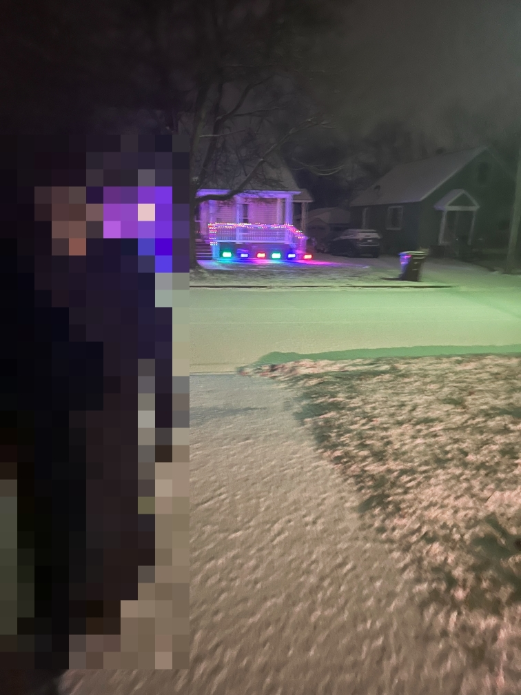
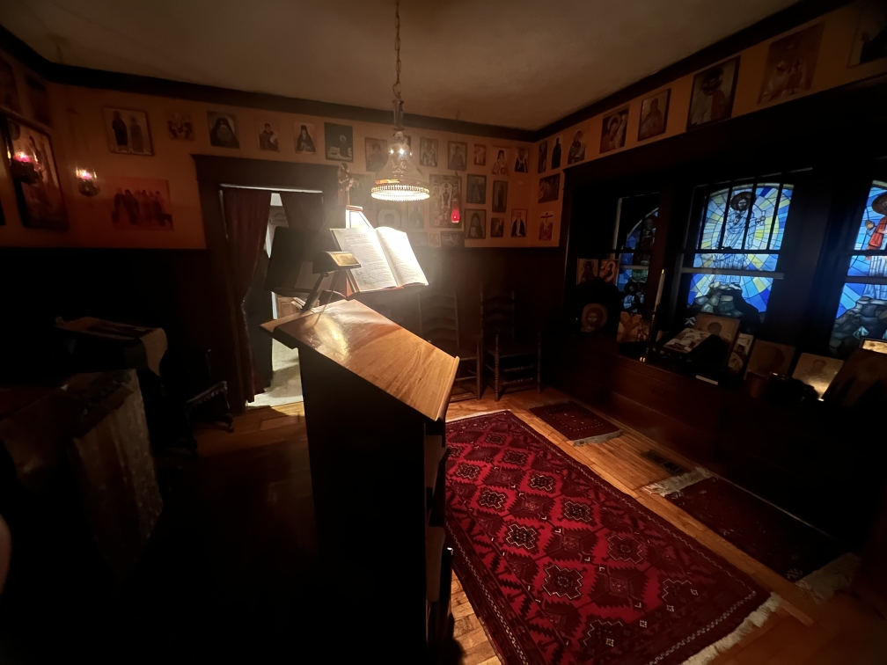
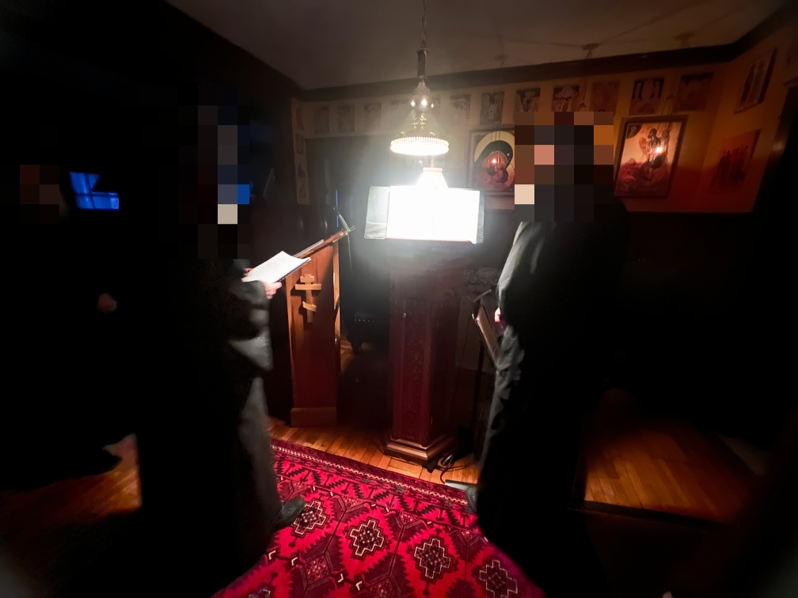
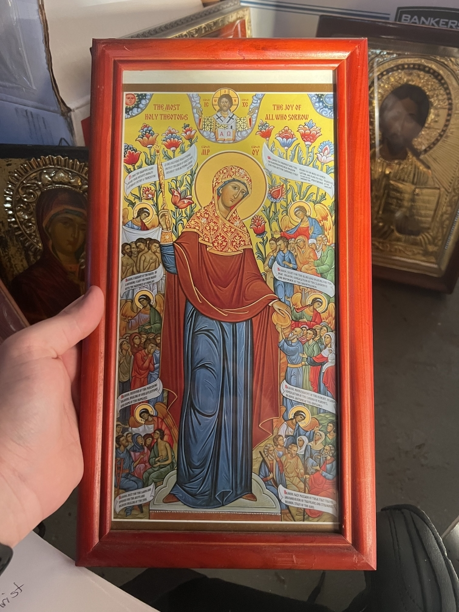
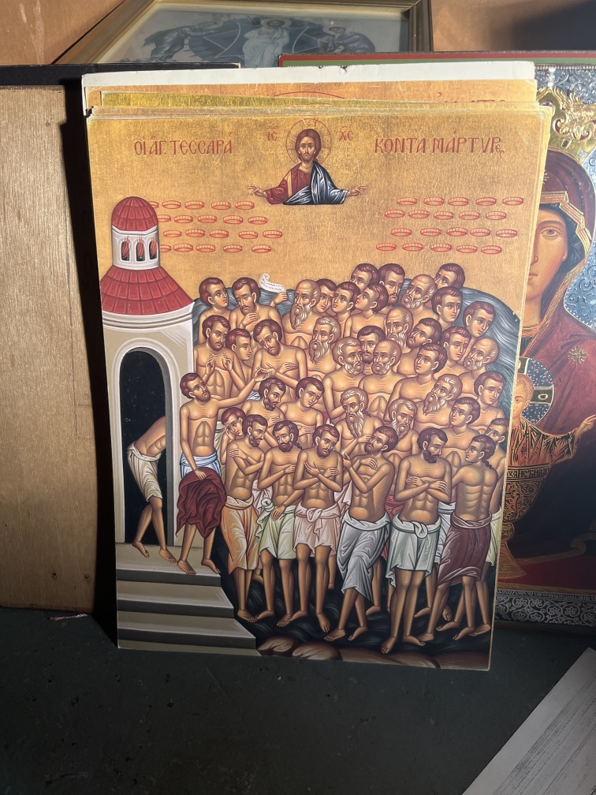

+++
date = 2024-02-16T18:49:12.000Z
lastmod = 2025-09-23T03:12:26.000Z
title = 'The Hermitage: Tuesday'
draft = false
slug = 'the-hermitage-tuesday'
t = ['Hermitage Trip 2024', 'Orthodoxy']
summary = 'Grace wielded not a two-edged sword, but one with three edges against the foe: a single blade forged in heaven and sharpened with threefold might, which ever fighteth for the one thrice-radiant Godhead.'
+++

It snowed! A lot! Apparently Fenton got nearly 5 inches, we’re a bit less it seems. I also slept without any leg cramps! Matins was good (did I mention I love matins?) but I found some of the verses today very good:

> Grace wielded not a two-edged sword, but one with three edges against the foe: a single blade forged in heaven and sharpened with threefold might, which ever fighteth for the one thrice-radiant Godhead.
> 
> Canon I of the Three Holy Hierarchs, Ode IX, Troparion II  
> *Translation: Rdr. Isaac Lambertsen*

> Let us sound the clarion of hymns,  
> that we may dance to festal music and leap up,  
> rejoicing in the all-honorable festival of our teachers!
> 
> Let kings and princes come together,  
> and let hierarchs clap their hands in hymns  
> for the three all-great rivers pouring forth doctrines,  
> the rushing torrents of the ever-living Spirit,  
> the pastors and teachers,the three initiates of the sacred mysteries of the all-worshipful Trinity.
> 
> And, assembling, let us praise them:  
> Let the philosophers praise them, because they are wise;  
> the priests, because they are pastors;  
> the sinners, because they are their intercessors;  
> the poor, because they enrich them;  
> those in sorrow, because they comfort them;  
> those who travel, because they journey with them;  
> those at sea, because they are their steersmen.
> 
> And let all of us everywhere, fervently praising the godly hierarchs, say thus:  
> O all-holy teachers,  
> make haste to rescue the faithful from the temptations of life,  
> and to deliver them from everlasting torments by your prayers.
> 
> Stichera on the Praises, Troparion IV  
> *Translation: Rdr. Isaac Lambertsen*

I had blunders too with chanting voice, remembering melodies and keys, so on. The lack of rest was apparent, but glory to God it all went well.

I struggled just now to remember the reflection from [the Prologue read today](https://web.archive.org/web/20240719024204/https://www.ohrid-prolog.com/index.php?lang=en&prayer_date=2024-02-12), thankfully it exists online. What spoke out to me most was part of the exhortation by St. John of Rila to St. Peter, Tsar of Bulgaria: be meek, quiet, and accessible to everyone. Living with monks the past 4 days has shown me more how one can be of this world but not in it - with meekness, silence, and accessibility. They have been very sweet to be with and their humility is wonderful. In their obedience to Fr. Ignatius (insofar as he is head of the hermitage, not spiritual father), the monks are like behaved children - I mean this in the most respectful way; forgive me if this sounds crude. They’re patient, eager to take responsibility for errors made, accepting correction and directions with virtually zero hesitance. If they fail, they are apologetic as much as they could ever be. But different than even well-behaved children, they condemn their faults in order to point out the strengths of their *brethren*. I do not know their interior lives. I’ve had glimpses of it in some of the struggles that they’ve mentioned, like Br. Herman and his reposed wife-to-be, Br. Michael and his ailing mother. They keep a brave face in speaking of those, but you can tell by their demeanor and the sound of their voice what it means to them.

As an example from today, Br. Herman and I were tasked to swap a faucet out in one of the hermitage bathrooms because Br. Michael accidentally broke the hot water tap. We (read: Herman, since I was not small enough to begin to fit in the very small space underneath the sink) made an attempt to replace it but it wasn’t designed to have someone go under it and use tools. You could tell that they put the faucets through the sink counter first and then attached the counter to the sink. Herman gave it his best but it didn’t work out so we decided to shovel together instead.

When I saw Fr. Ignatius after shoveling ended and Herman went to the hermitage *(no pun intended, anonymized name made before seeing this)*, he asked me how it went and I told him what happened. He seemed a bit confused since he thought that it was more trivial, instead of this weird plastic piece that has to get screwed off. He’s not a guy that is upset by default, he expressed no frustration about it. Herman would tell me later on our way to vespers about how apologetic he was to Ignatius about it. I mentioned that I had brought it up to Ignatius since he asked - I don’t know if that marked the turn in his countenance but he seems downcast tonight, through vespers, dinner, compline, and the cleanup after. Anywho the point being that the apologetics of Herman truly do come from within, he is a humble man with a poetically tragic background, quick to find the good in why things happen.

I have not seen as much of Michael, and have not had as many conversations with him. In our first relatively one-on-one conversation he had asked about my patron saint, and he remarked that I have his countenance. I laughed and said I was just missing the hunch, but he meant every word of it. Like Herman, he too is obedient to Ignatius like a well-behaved child, but is a bit more loose. Herman won’t dare eat dinner without receiving Ignatius’ blessing, even if it’s hours after dinner was meant to happen. Michael… seems that he would have done without (after all, they do at breakfast).

All in all, I’m very thankful to be surrounded by these men of meekness. They have been exceptional to me and I hope to achieve even a quarter of the virtue they’ve cultivated.

I’ve spoke a bit ahead of myself so I will briefly recap some things that have happened today. After Matins, I visited one of the regular laity Tikhon’s “software lab.” He invited me to check it out since he heard that I was in software. He has a whole array of LED panels, he makes gas station price signs. After that, I went back to the guesthouse. I made another PBJ for breakfast. I spent the rest of the time between then and 3rd+6th hour (at noon) reading and praying the Jesus prayer. The hours went by quickly, as those always do. Afterward we had trapeza (lunch) in silence while Br. Michael read from the Evergetinos. I was then given leave to take a bit of rest until Herman came by later so we could work on the faucet - you know how this ended. After, Ignatius arrived with the groceries he went to get and I helped load them into the house (this was when he asked me about the results too). Shortly after he asked me if I could make some inventory of the icons that we had got from [closed church]’s storage unit. He originally wanted to work through it with me but he was still packing groceries and I assured him I was fairly able at identifying them. There were some notable ones like a couple of gold-plated icons, this 103-in-1 icon for the ambo stands (basically it’s a huge stack of icon sheets, swap them out for the day), and a couple of icon sets.

I finished all 4 boxes at almost exactly 5pm, I sat in the bedroom for a bit when Herman came to have us walk over to vespers. Vespers was very simple and easy, given it’s a small vespers not a great one. We returned to the hermitage and dinner shortly followed. This again was in silence but with Fr. Ignatius reading from John Cassian’s Conferences. Right after they do compline and this interesting practice of venerating the patrons of everyone in the room almost by treating that person as an icon of them *and as an act of asking forgiveness of each other*, including myself, and then venerating the various patrons associated with the hermitage. We said our goodnights and now I’m here writing this. I still felt that mood difference in Herman’s voice but I have to leave it to him. It’s not my place to ask or help. I hope that he feels better and God has mercy on him.

I’ve been pondering some on my spiritual state, especially as I take part in everything here. It seems that here I have moments where grace is more clearly present and times where it’s seemingly entirely gone, all within the same day over and over. I feel like I must have some sort of blindness or something, I’ve been in a very low-temptation environment and cannot begin to see any sin beyond logismoi, maybe talkativeness (I’m not used to the monastic silence), and the obvious sin in thinking that I have little or no sin. I don’t understand. I don’t know if the scale is shifted here where the sins one deals with are the ones that are so deeply buried and pervasive that they are virtually unnoticeable externally, after all in the Conferences reading earlier there was a mention about how those in the world are struggling with great sins. I truly can’t work it out yet. I’ve been asking for the Lord to free me from the blindness I seem to have, but He has only given me a little. It’s difficult in that because I cannot perceive or even sense temptation and sin in this environment, I cannot really repent of it. I desire *to* repent, but it seems as though I have so little to repent from here. We talk about how monasteries are the frontlines of spiritual warfare, and I am not one to seek to deny it that title - however, the only conclusion I can make in this case is that the best way the demons found to war with me here is to make it seem as though absolutely none of it exists: that there are zero temptations beyond the rare intrusive thought, and therefore I don’t need to think about repentance since I feel just fine. It’s either that or God, the saints, and the angels have been so merciful to me that they have prevented this battle from happening knowing how obliterated I could be. I don’t understand, and I want to. I’ve had the thought to even ask for temptations, that I have something to noticeably work against. I wrote in previous days about deferring myself to God’s will: that has not changed and I am still guilty of it, but as I mentioned then - I feel so useless how to attain this, with my inattentiveness and lack of spiritual sense.

I’m not sure, maybe God will show me soon.

Lest I sleep late and little again, I will stop writing. Goodnight.

