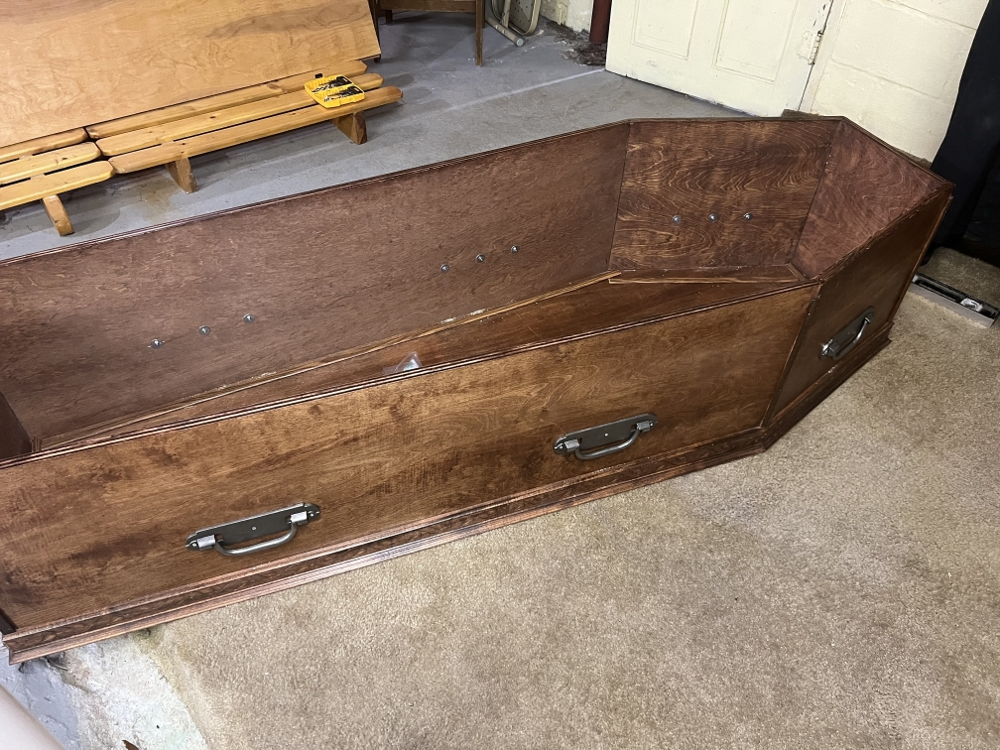
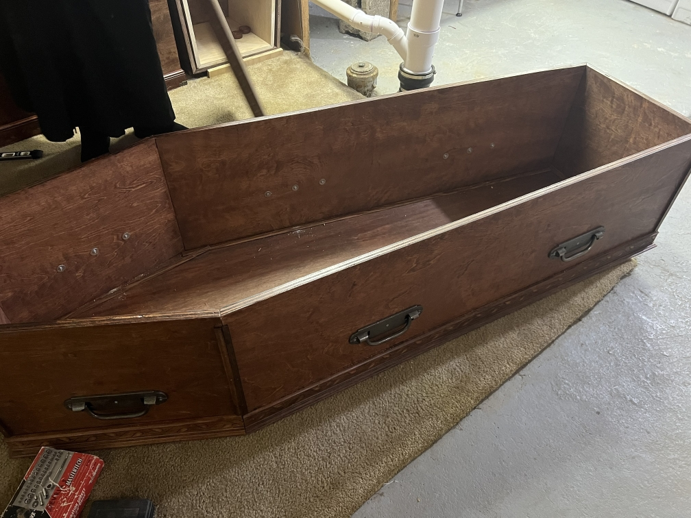
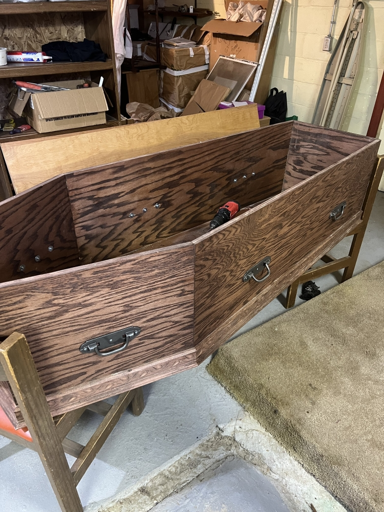
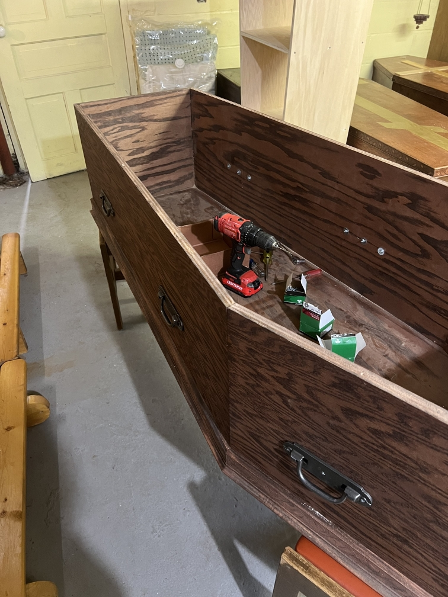
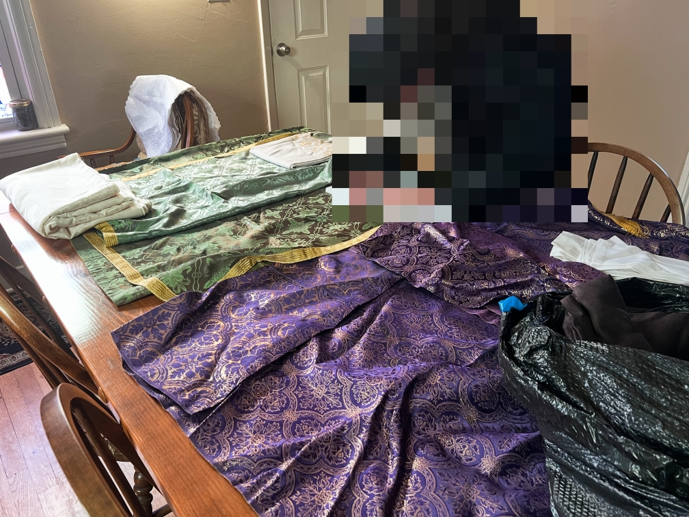
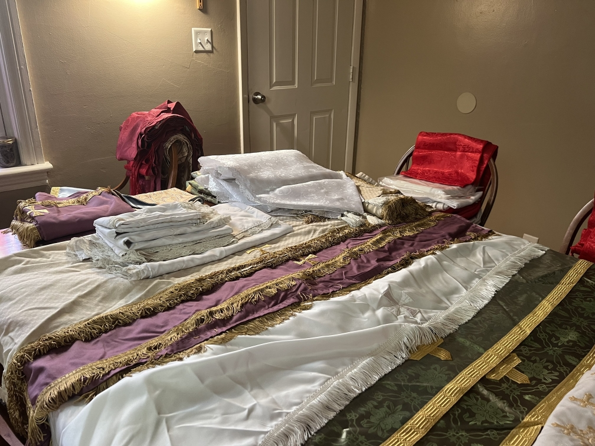
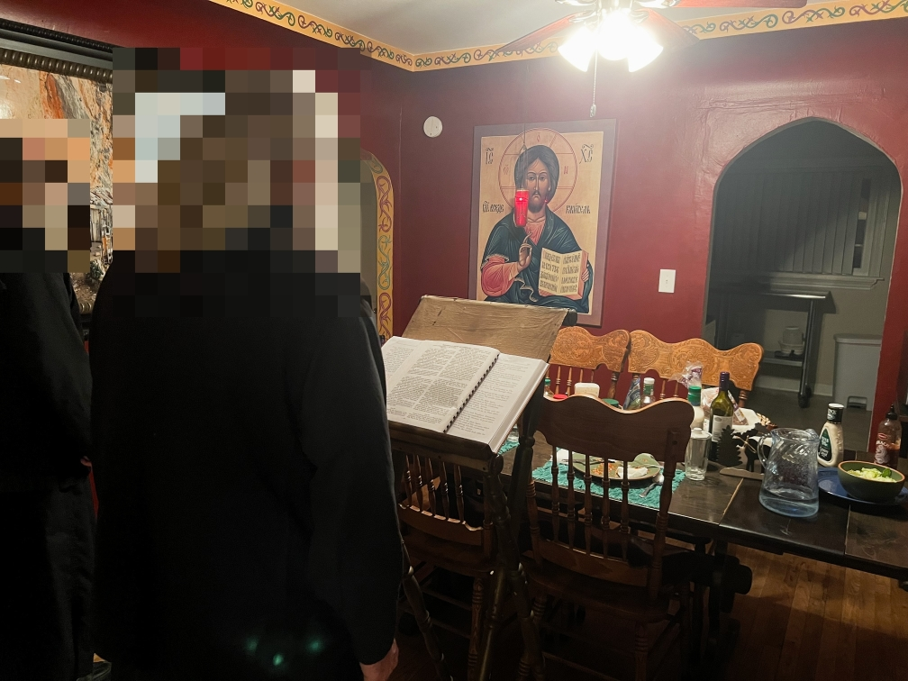

Good morning. There’s fog outside as it’s warmer today than yesterday. The snow is still on the ground but I don’t know how much of it will be left tomorrow. I’ve been trying to have a takeaway in every Matins. I have a couple, one that I am having trouble recalling and one that speaks to the former: inattentiveness as my sin. Lord willing, I recall the other.

I do not speak of my imbued (as it were) inattentiveness as a personal sin of itself. I can’t, I have no desire to be inattentive and while the medication is helpful it is not perfect. I speak to the effect of sin, inattentiveness is a sin that plagues me. Like Paul’s thorn, it is simply there and will keep me in check insofar as I recognize that it is not to be desired or kept. In this context, personal sin is only to be found in whether I do anything about it, whether I learn about it in order to fight against it or work around it. If I don’t do this, then I accept complete failure, consignment to the ailments that I’ve suffered and will suffer for the rest of my life and allowing it to overcome me. This, for me, results in spiritual death. If I do nothing, I can only be a clanging gong about the faith and Christ, theory but no praxis. If I do nothing, I will hardly ever pray, beyond the occasional short phrase. I won’t be able to focus on any services and therefore cannot pray within them, and striving to live a life of virtue will be largely dead in the water because I won’t think about it.

The reason that this has occurred to me was that during Matins, despite medication and a cup of coffee, I was not able to keep focus compared to the previous days (and of course, it was never perfect then either). There’s a couple of reasons why I think this may be the case. The first is that there is still much novelty, and my brain resists attentiveness when there is so much new around me. Even though I’ve experienced it for a couple days, it’s still new. The other is that this is the battle I’m meant to face while here at this hermitage, more front and center.

It bothers me greatly in that I was well aware of how inattentive I was, yet all of the effort I could do was not even close to maintaining a semblance of focus. I can’t even blame intrusive thoughts. For all that I could do, I prayed that Christ would account the prayers of the others to me as well, knowing that I couldn’t be prayerful myself. May God help me and have mercy on me.

I helped Br. Michael with coffin handles in the first portion of work. We were able to get two coffins done. The second he had to leave midway through but he showed me well enough to finish it up, and I learned a technique to make tightening them to the boards quicker. There is prayerfulness to the task but it can be difficult to do in praxis, dividing attention essentially. Br. Michael mentioned that he too had ADD so we were in similar situations, I suppose. I asked him what led him to monasticism, he gave me some short answers: providence, and things not working out with his wife. He mentioned that were he an obedient husband, he wouldn’t have been a monk. From what I’ve gathered, I don’t believe he abandoned his wife or anything, but he mentioned she had breast cancer. I don’t know if she reposed from it. I didn’t pry him any, but he told me that he ultimately chose monasticism because he sees it as the only reasonable option for him as a single man. He’s 67 from what Herman told me (although I don’t know how old the others are exactly*- I later learned that Herman is 53, Fr. Ignatius is likely around Herman's age*).

I also learned from Michael that the hermitage in-a-way started in Colorado with him and Herman. Herman had moved to Michigan [redacted] and not long after Michael followed.

Work went well, all in all. I ended around 11:30, so I decided to stay in the lounge area of the hermitage for the half hour leading to 3rd and 6th hour. Fr. Ignatius was going to lead 3rd hour but he let me do it. Admittedly, I deviated from their text since I know the OCA ones and they have the Jordanville horologion. Ignatius said he likes the OCA wording more, so that’s a plus.

We had trapeza, same burrito situation, and after a brief moment of rest, Br. Herman and I were commissioned to try and make inventory of the cloth items we got from the storage unit. Michael told Ignatius he was feeling unwell, so he went to rest in his cell. There were a LOT of items, from altar cloths to icon stand cloths, various other table cloths, huge normal table cloths, weird diamondish runners, and a box of 16 sticharia. Herman made a broad list of what we found but Fr. Ignatius suggested we leave it out for Fr. [redacted] (priest of [redacted]; their confessor) in case he’s interested in anything. Apparently we’ll work out what to do otherwise tomorrow. Liturgy days have no other structure planned ahead of time, so it’ll just be whatever God leads us toward.

After this, Herman went back to the hermitage to help Ignatius convert the little chapel area to be more spacious for the liturgy that will happen there. I took a shower and arrived about 15-20 minutes late of the time they planned to do it and yet those two had done it all already. Nonetheless I was thanked by both Herman and Michael for my assistance despite me stating I did absolutely nothing.

We had a period of rest before we needed to head over to the church for vespers. It had a very low attendance, myself, Fr. Ignatius, Br. Herman, and Mother [redacted] (Ignatius’ mother), but surprisingly Michael arrived too. Herman and I were glad to see he was feeling well enough to make the ~10 minute walk over and able to stand for the service. The service was very brief given the small stichera. However, I got to read part of the 12th Kathisma. More notably, I read 85 and 87 (86 too but not very notable). I found these very pertinent to my dilemmas as of late. Psalm 85 goes:

> Bow down Thine ear, O Lord, and hearken unto me, for poor and needy am I. Preserve my soul, for I am holy; save Thy servant, O my God, that hopeth in Thee. Have mercy on me, O Lord, for unto Thee will I cry all the day long; make glad the soul of Thy servant, for unto Thee have I lifted up my soul. For Thou, O Lord, art good and gentle, and plenteous in mercy unto all them that call upon Thee. Give ear, O Lord, unto my prayer, and attend unto the voice of my supplication. In the day of mine affliction have I cried unto Thee, for Thou hast heard me. There is none like unto Thee among the gods, O Lord, nor are there any works like unto Thy works. All the nations whom Thou hast made shall come and shall worship before Thee, O Lord, and shall glorify Thy name. For Thou art great and workest wonders; Thou alone art God. Guide me, O Lord, in Thy way, and I will walk in Thy truth; let my heart rejoice that I may fear Thy name. I will confess Thee, O Lord my God, with all my heart, and I will glorify Thy name for ever. For great is Thy mercy upon me, and Thou hast delivered my soul from the nethermost hades. O God, transgressors have risen up against me, and the assembly of the mighty hath sought after my soul, and they have not set Thee before them. But Thou, O Lord my God, art compassionate and merciful, long-suffering and plenteous in mercy, and true. Look upon me and have mercy upon me; give Thy strength unto Thy servant, and save the son of Thy handmaiden. Work in me a sign unto good, and let them that hate me behold and be put to shame; for Thou, O Lord, hast holpen me and comforted me.
> 
> Psalm 85  
> *Translation: Psalter According to the Seventy, HTM*

The Lord did comfort me in that I was able to have some attentiveness to the prayers. I felt and still feel pain over my inability, but He is hearing me. The Psalms I were blessed to read were providential, God knowing that I needed the words to make these laments to Him. Psalm 87 is especially the case:

> O Lord God of my salvation, by day have I cried and by night before Thee. Let my prayer come before Thee, bow down Thine ear unto my supplication, for filled with evils is my soul, and my life unto hades hath drawn nigh. I am counted with them that go down into the pit; I am become as a man without help, free among the dead, like the bodies of the slain that sleep in the grave, whom Thou rememberest no more, and they are cut off from Thy hand. They laid me in the lowest pit, in darkness and in the shadow of death. Against me is Thine anger made strong, and all Thy billows hast Thou brought upon me. Thou hast removed my friends afar from me; they have made me an abomination unto themselves. I have been delivered up, and have not come forth; mine eyes are grown weak from poverty. I have cried unto Thee, O Lord, the whole day long; I have stretched out my hands unto Thee. Nay, for the dead wilt Thou work wonders? Or shall physicians raise them up that they may give thanks unto Thee? Nay, shall any in the grave tell of Thy mercy, and of Thy truth in that destruction? Nay, shall Thy wonders be known in that darkness, and Thy righteousness in that land that is forgotten? But as for me, unto Thee, O Lord, have I cried; and in the morning shall my prayer come before Thee. Wherefore, O Lord, dost Thou cast off my soul and turnest Thy face away from me? A poor man am I, and in troubles from my youth; yea, having been exalted, I was humbled and brought to distress. Thy furies have passed upon me, and Thy terrors have sorely troubled me. They came round about me like water, all the day long they compassed me about together. Thou hast removed afar from me friend and neighbour, and mine acquaintances because of my misery.
> 
> Psalm 87  
> *Translation: Psalter According to the Seventy, HTM*

After Vespers, I headed back to the guesthouse and did some reading before dinner started. When it did, the passage from John Cassian’s Conferences had a very good recounting. Essentially, it reduced to saying “O God, incline unto mine aid. O Lord, make haste to help me.” in every moment. Fr. Ignatius described it as the Jesus Prayer of St. John’s time. I found it very edifying and I resolve to make more use of it in difficult moments, with the Lord’s help.

After dinner, compline as per usual. As of late, the brethren and I have had this weird tickled throat, and it really hits all of us in the mornings and evenings (Tikhon too). It forces my voice into a lower register which sounds great but I’d prefer if it wasn’t because I was locked in.

Once compline and the venerations ended, I made the bows of forgiveness to the brethren and resigned to my cell. It is 8:22 as of me finishing this entry. Tomorrow I will still wake up at the same time, we will still be doing matins our way (thankfully, no offense to [redacted parish name]’s abridged matins) with the liturgy being in the hermitage as well. I’ll be coffeeless, so it is my fervent hope that the Lord will grant me attentiveness. We’ll see how it goes considering our parish friends will attend the liturgy.

I’m very thankful for my experience of this life thus far. It has been edifying in so many ways, but ultimately I am not called to this. I like the stillness of the environment and its structure, and hopefully I can bring and instill some of it in my own home, but it isn’t my place. However, I’ve learned here that the monastic life and the life in the world don’t need to be all that different - in fact, they can be very similar. Were it not for the lack of liturgical furniture and resources, our own normal lives could be quite analogous to this monastic one. There is not a whole lot of separation between the two. The big differences are in the material, where the material needs here are largely addressed, that the monks can focus on their inner life and the spirituality of the hermitage (that is, music and iconography). For us in the world, we have to be occupied with these things more. It isn’t a bad thing, but it changes the scale. The low external temptations make the internal easier to battle with. Those in the world have to deal with both in similar measure. This is not to say that monasticism is trivial, but there is just as much salvation to be found in monasticism as there is in the non-monastic life. To quote St. Niphon from [today’s Prologue of Ohrid](https://web.archive.org/web/20240917085253/https://www.ohrid-prolog.com/index.php?lang=en&prayer_date=2024-02-13) reflection:

> My child, a place neither saves nor destroys a man, but deeds save or destroy. For him who does not fulfill all the commandments of the Lord, there is no benefit from a sacred place or from a sacred rank. King Saul lived in the midst of royal luxury and he perished. King David lived in the same kind of luxury and he received a wreath. Lot lived among the lawless Sodomites and he was saved. Judas was numbered among the apostles and he went to Hades. Whoever says that it is impossible to be saved with a wife and children deceives himself. Abraham had a wife and children, three-hundred-eighteen servants and handmaidens, much gold and silver but, nevertheless, he was called the Friend of God. Oh, how many servants of the Church and lovers of the desert have been saved! How many aristocrats and soldiers! How many artesians and field-workers! Be pious and be a lover of men and you will be saved!

Goodnight.

