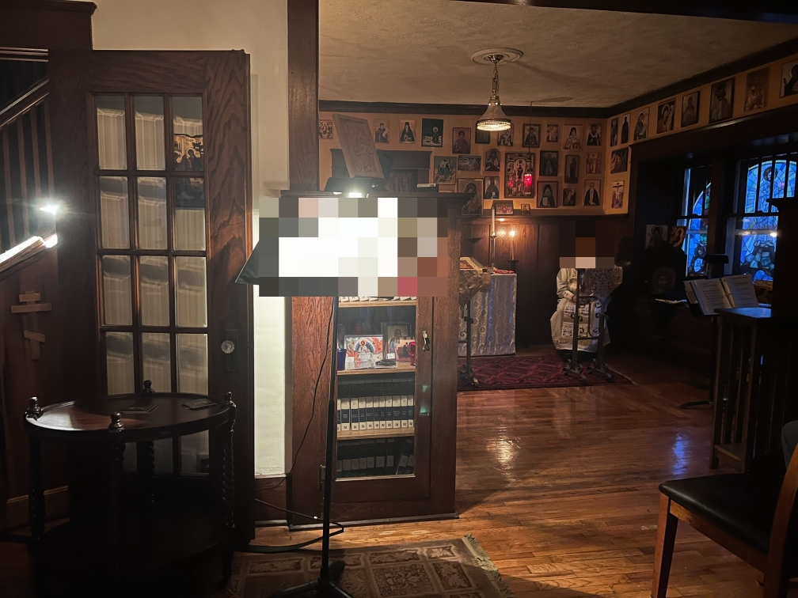
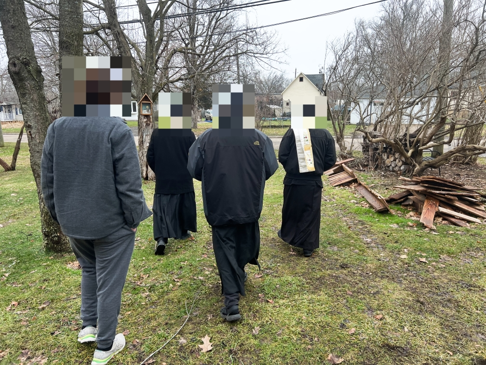
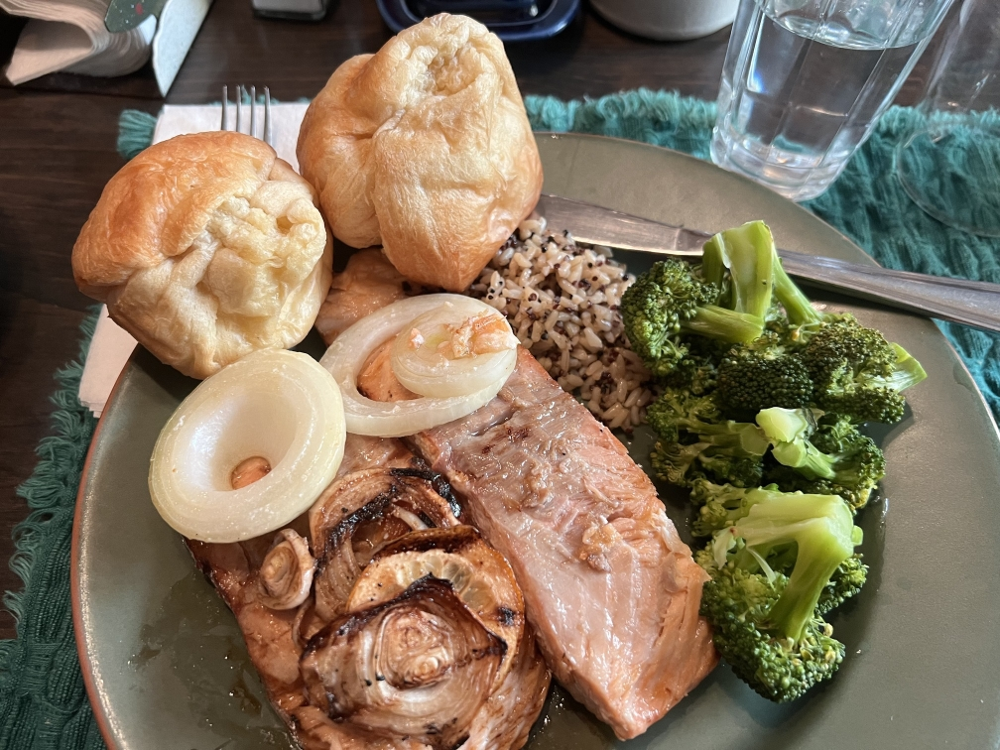

### Day 5 - Thursday

Good afternoon. A busy morning! We had matins, did 1st+3rd+6th hour to fill time for the liturgy served in the hermitage. It went very well, although the physical strain of the previous days was setting in a bit. I had trouble standing comfortably without moving around or trying to stretch. Thank God, we’ve been told to rest for the remainder of the day not counting vespers, dinner, and compline. I decided to eat and write, soon I’ll start some laundry and read for a bit.

I don’t have a particular reflection for the services today thus far, I was not necessarily inattentive but it was hard to think about anything but the service and needing to create some sense of physical comfort. It was nice taking communion in the hermitage, though.

One of my friends visited (as he usually does when liturgy is hosted at the hermitage) and we spoke for a little while after liturgy, summarizing to some degree how the week has gone thus far. Once he left, I listened in to a conversation Fr. [redacted; monastics' confessor] was having with some others in the room about strength and humility in caretaking contexts.

Once that was finished, we proceeded to have him bless the barn they’re seeking to convert into a chapel along with the guesthouse. They had confessions with him in the guesthouse after, so I went back to the hermitage. I helped Br. Michael return the chapel area back to normal, along with a 16-year-old catechumen (kinda, his situation is a little different) named Joey. Him and I spoke for some time after about our backgrounds and the experience of the Orthodox life. It was all very edifying and he’s got a good head on his shoulders. He’s also learning to make icons, which for the 4 months he’s been learning with YouTube videos, he’s doing incredibly well. If you stumble upon this at all, Joey, keep it up - you’ve got a bright future ahead of you.

Fr. Ignatius returned and we spoke with him a bit, but I returned to the guesthouse as he’s off to prepare services with Joey.

In the short bit I’ve been here (to be specific, back in the guesthouse at this moment), I’ve noticed myself hitting a limit with social media use. When I wanted to do this trip, I intended to use it as minimally as possible but I’ve pretty much violated that just as a way to fill in time. I’ve kept away from social media largely, but when I am there I find myself stumbling upon things or getting into conversations that just make me frustrated. I’m realizing more the destructiveness of it. Or, at least, the bubbles that I thought I had established are tearing apart a bit. I need to work out a balance, anywho.

I decided that I would seek confession for these thoughts, along with the thoughts I had suffered against Mother [redacted], Ignatius’ mother. I started laundry and not long after, Joey and Ignatius returned. They went upstairs to have Joey work on some of the iconography Ignatius has been painting on the walls. I spent some time writing my confession, waiting for approval from my priest to have confession with Fr. Kentigern. Once this was the case and Fr. Kentigern allowed me to have confession with him, I rested for a bit before going with Joey to Vespers. Matushka Andrea, a widow who lives in an apartment on the property of this guesthouse, was heading off to it and decided to give us a ride. Mistakenly, she thought I was in the car and started driving, which I believe led to part of the door latch brushing the side of my leg. I haven’t checked if it looks off but it didn’t hurt beyond some pressure and doesn’t hurt now. Once we arrived, I got prepared at the choir stand when something made my remorse worse. Mother [redacted] had arrived with her daughter and son-in-law, and they had her lay with her back propped up on a pew. She took a fall earlier today and cut her leg. I felt and feel awful about it, responsible because of the terrible intrusive thoughts that I entertained. I have confidence that this is a demonic attempt in despair, to make me feel worse for my sins at her physical expense. God, forgive me, a sinner. Once vespers had finished, I went to do confession with Fr. Kentigern. I said aloud my written confession:

> I’ve been battling with thoughts of anger and pride. Earlier in the week I was assailed by thoughts that created judgment toward Mother [redacted] seemingly out of nowhere. For some reason, maybe pride or envy, the mere fact that she has always has a chair of her own to sit caused me offense and I had thoughts of contempt over it. I didn’t even know her and still really don’t, all I know is that she’s a sweet, elderly woman who’s only said nice things to me since being here and yet my thoughts created this false image of her.

I added here that hearing about her fall made my remorse worse. I didn’t know about it at the time of writing.

> I resolved to use technology minimally in the week but I’ve violated that as I’ve become bored in downtime. I’ve found myself getting caught up in crossword games and so on, putting off the spiritual matters that I intended to focus on this week. Additionally, for the brief moments I’ve used social media, I’ve found myself in situations where I’ll see something or get into a conversation that causes me offense, creating thoughts of pride and anger that I failed to reject.

Fr. Kentigern’s confession style is quite interesting. It has a therapeutic element in that it… uses therapeutic methods. He asked questions in such a way that it essentially creates an answer within myself, with God’s help I’m sure. An example of this was when discussing attentiveness and the phone use, where the idea had occurred to me that instead of relying on comforts like games or whatever, to pray to God asking for something for me to be attentive to. Admittedly, skepticism creates doubt in whether this would do anything, but I must have faith that God will and wants to help me through this, it may simply not be what *I* want.

After confession I headed back to the guesthouse. Along the way I encountered Br. Michael standing behind a house, just barely noticing him *(note: this was around 7pm at night)*. He had apparently just been in a phone call with an update about his mother. She’s doing relatively well, but she may have caught a virus going around that’s creating dizziness.

I returned, got my laundry out of the dryer, folded it, and put it away just in time for dinner. They made chicken nuggets. Now, I don’t know if it was actually chicken, I don’t know if the feast day allows them that (although I know they can have fish), but either way it was good. Fr. Ignatius read more of the Conferences, and some of it was still about the Psalm phrase. Once dinner was done, compline was as usual, and after a brief chat with Br. Herman I’m now in the cell writing this. I will go to sleep soon. Thankfully I don’t need to wake up at 5am (although I’ll miss the matins given that today was the last day of it while I’m here), so I’m looking to move my wake up time to what I’ll want to wake up at regularly once I’m back home. I’ve got a good springboard to use.

I have been debating whether or not I want to go home sooner. This could be a temptation, maybe not. I would like to talk to my priest about my confession and get back into the flow of things. It could be good too since I can have a few days of rest before I return to work on Monday. My current plan would basically give me only a night in between being here and work, which doesn’t sound like a great idea for me. Part of me is anxious in that I’ve seemingly got quite close to the fire enough to get a little burn, and part of me fears that staying here would immerse me in it further. There would be a decent amount of free time, and as we know that is not my friend. Given my concerns about free time with Fr. Ignatius before I came here, maybe it’s best that I return even if under that pretense. I’m not sure. Maybe my persistence is the solution, maybe not.

After discussing it with my wife, I’ll leave a day earlier, on Saturday morning. This way I get some time to transition between and I can get another night with the brothers. I plan on getting a group photo with them.





### Day 6 - Friday

Good morning. Today started off snowy and windy but after liturgy the snow stopped.

I woke up at 6am, compared to my 7:30am alarm. I decided to just occupy myself with my phone which really didn’t make me feel good. It feels wrong returning back to it like I used to after this week. It’s made me sad, like I’m going from living where Christ is my life to Christ returning back to simply a *part* of my life. Part of me thinks that this is just sorta how it is being someone in the world, I don’t know.

Liturgy went well, I tried to remain positive through it. I said goodbye to most of the people there since I’m leaving tomorrow morning. They were all blessings, although I need to say goodbye to Tikhon still, he left before I got the opportunity.

I feel like I need to have some grand summary on this past week. Some words to succinctly describe how it’s been for me. In some sense, I don’t think I will know how it’s truly been for me until I’m back home in my regular routine. It has been peaceful, it has been trying in ways that it would not have otherwise been were I not here, it has been enlightening, it has been instructive, it has been a blessing. I don’t know if I’ll ever have a stay at a monastery like this stay for decades, but I know that I would like to attend the monthly liturgies they hold in the hermitage.

The dietician visit happened, I think it was good for them and they got some key takeaways. Shortly after we had our salmon lunch for the feast and it was amazing, Michael mans the grill and the teriyaki sauced ones couldn’t have been better. We then had rest for some period going into vespers, said some more goodbyes to the parishioners of [redacted]. We held compline there too and headed back to the guesthouse.

Michael and Ignatius left not long after leaving myself and Herman in the kitchen, the same as when I first arrived here. Him and I had a long but edifying conversation. I could write for hours on everything we discussed, some I can’t speak of for privacy, but we concluded in one of the best hugs I’ve ever had, and told him that I would seek to attend the monthly liturgies they held here. He told me that he considered me like family and was very glad to hear my plans. We said our good nights and now here I am writing. I have so many thoughts and emotions going through my mind, so many things that I could say, but for once I think I will keep this to myself and share the essence of them when I’m called to do so. I’m incredibly thankful to all the people I’ve met, I couldn’t have asked for more.

I’ll leave when I wake up in the morning, although if it’s too early I think I’ll wait until sunrise.

Thanks to whoever reads this. I hope you’ve found it edifying. Please forgive me for any errors I’ve done, even if by omission.

I have intention to write a recap of the experience insofar as the spiritual life is concerned, but to also put it in context of my return to the world. The entry for Friday included the group photos with everyone (in Obsidian where I wrote this daily), but I felt it inappropriate to post here even if censored.

