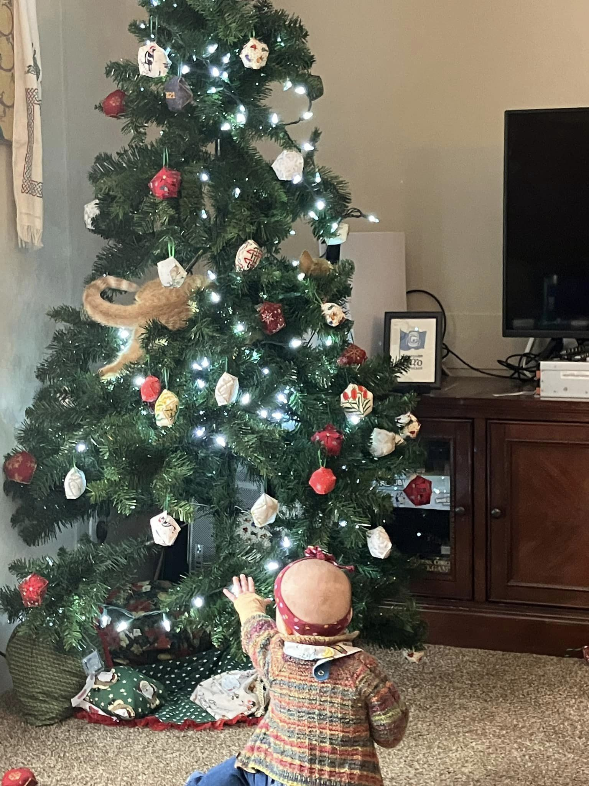

{}My original plan was for this to be one post, but as I got writing, I realized that this was quickly becoming way too much to read in one sitting.  
 
This is the first entry of [a series of introspective posts](/t/reflection-age-legacy/) intended as a primarily therapeutic endeavor.{}

I’m not 17 anymore.

Not that it surprises anyone (or even myself). However, I was about 17 years old when my life trajectory substantially changed - leading to where and who I am today. My later teens were some of the best and worst years of my life so far (as ye olde blog posts would tell you), and I am thankful for all of the formative experiences I had. I am not me without them.

But, I find myself today considering that I am not the person I was a year or two ago. I still have all my weaknesses and strengths. Still, the challenges and experiences within the past two years have brought me slower to the realization that I have lived life with a mindset of infinitude - that I and everything else that makes up who I am and what I do will be around for as long as I wish for them to be. The reality, of course, has instructed me differently.

So, as I write this, I ponder upon some key questions that have been sticking with me the past little while, like:

1. Where am I now, and where am I headed?
2. Where do the things that I once enjoyed (and merely maintain at this point) come to an end, as all things do?
3. How do I reframe myself around these new defining factors I face?

I’m unsure if I will have a noteworthy conclusion in this introspection. I’m writing this mainly as a therapeutic endeavor. Maybe it will provide perspective to those of similar circumstances; perhaps it will explain to those around me wondering about my tendencies as of late.

I will also note that this post is not a return to the autobiographical types of posts I’ve written in the past. It served a purpose at one point in my life, but I don’t believe much good can be found in recapping like I used to.

---

### Where am I now, and where am I headed?

The foremost is that I’m a father (I write as I move my 8-month-old daughter away from the shiny light-up rectangle with buttons). I’m also a husband in our 3rd year of marriage. I have a simple home, a manufactured one, and an opinionated menace for an orange cat.[^1] I have a car with some negative equity and a software engineering role with a company contributing a moral good to all. I’m minor clergy contributing what I seemingly have to offer back to the Church. There’s a lot to be thankful for. I live a life that 17-year-old Elliott could not have imagined was possible, especially in less than 10 years.

That’s not even counting the spiritual growing pains: going from Theravada Buddhist to Episcopalian, to trialing Catholicism only to revert to Buddhism to cope with another wave of depression, to becoming Confessional Lutheran in the LCMS and being essentially given a gateway drug into Orthodoxy, which I would begin to pursue months after I was confirmed in the LCMS. Then, I began life in Orthodoxy, spending nearly two years seeking the catechumenate from the near-wasteland of Orthodox Christianity, St. Clair County, Michigan. In those two years, I attended a parish liturgy about 3ish times, instead occasionally attending liturgy[^2] at the Elder Ephraim-founded monastery that spoke only Greek in the services. I was made a catechumen in November 2019 and received during the thick of the pandemic in June 2020, but during that period, I only attended the monastery every so often.

My “wandering in the desert,” if you will, persisted for about a year and a half after I was received. It wasn’t until October 2021 that I was recruited to the company I’m at now, that I could get my (aforementioned) car and attend my first set of Nativity services with my home parish. I would move to an apartment just 5 minutes around the corner from the parish the following January.

The rest is largely history from there, from me meeting my now-wife, getting married, and sharing life as low as the sorrows of miscarriage to as high as the joy of new life. This glosses over a lot of the struggles and hardships within these past 10 years, things that I’m more likely to mention in reflection of the difficulties I endure today, things that I have yet to really break down and comprehend objectively so that I might have a greater means to healing. These are for other articles and anecdotes. Forgive me for my tangent. Suffice it all to say that the life I’ve gone through experientially differs from the life I live now, in the day-to-day moments, dispositions, etc.

Where has that led me? The first word I can think of that summarizes my general disposition of life is “disillusionment.” That word carries a lot of weight, but I speak not toward the feelings of dejection or disdain for the life that I now live. Instead, I speak toward a sort of acquiescence or yielding to what life consists and has consisted of. One might be inclined to see this as analogous to Ecclesiastes[^3]; one may also be inclined to see this as clinical depression taking on a new, almost-nihilistic-flavored form in my life.

I would not consider myself depressed, and certainly not in a nihilist mindset. Life and all that it carries—whether good or bad or in-between—serves a purpose, with the ultimate purpose being to give us a means toward holiness. When one suffers through a miscarriage, a new opportunity arises to fall toward Christ, Who will catch you and console you in a way unimaginable to your mind at the moment. When one experiences the joy of new life, an opportunity arises to glorify and give thanks to Him, Who sustains all life in His providence. Maybe I could have done these things better if my brain were not so wired to pursue novelty and stimulation.

> That which has been is what will be,  
> That which is done is what will be done,  
> And there is nothing new under the sun.  
> Is there anything of which it may be said,  
> “See, this is new”?  
> It has already been in ancient times before us.[^4]

…is a summation of my disposition. I do not lament the life I have, nor do I grieve for the life that I could have had. However, I understand that I am in obedience to Christ, my wife, and my daughter to endure the lows of life and cherish the highs. The alternative is to allow myself a life where I am like a flag waving with the changes in wind, unstable and easily susceptible. I, like many others, have a cross to carry, but I am at a stage where what is certain is that the cross will always need carrying.

> And whoever does not bear his cross and come after Me cannot be My disciple.[^5]

To take only a tiny remnant of Sweet Dreams (Are Made of This), “who am I to disagree?”

> For to this you were called, because Christ also suffered for us, leaving us an example, that you should follow His steps.[^6]

I learned in retrospect of [my hermitage retreat earlier this year](/t/hermitage-trip-2024) the reality of God chastising (or at least permitting thereof) those Whom He loves. While I would not consider myself worthy of that love, I can’t say God loves all and that I’m the exception. I face struggles and temptations uniquely catered to my weaknesses, that I might abandon my pride (particularly in my urge to take credit for the resolutions of these struggles and temptations) and instead have humility, glorifying and giving thanks to Christ for all things. Yet, being so acutely aware of what I am called to do in response to these difficulties, I am acutely aware that I hardly put in the effort to do that. I have found hope in my ironic hypocrisy through the letters of Abbot Nikon Vorobiev:

> To (N),
> 
> “He who rejects justified or unjustified criticism, rejects his own salvation.” Whoever gains the ability to see his own sinfulness sees not individual sins, but the complete distortion of his soul, which constantly exudes all manner of evil. What’s more, he sees that even his good deeds are saturated with the poison of sin. When a man see this clearly, and likewise becomes convinced after a thousand incidents that he cannot heal the leprosy of his soul on his own, then he will genuinely (not artificially) humble himself, will stop judging others, and no longer take offense when his feelings are hurt. In others, too, he sees only the same fallen nature that he notices in himself, and pities them as common friends in misfortune. He will then stop exalting some and belittling others. He will stop judging altogether for, on the one hand, everyone is fallen and, on the other hand, “human measure deceives” no matter how objective we try to be. How can a man then justify himself in his sinfulness? How can he be offended if someone accuses him of something he is seemingly not guilty of, when we all have a countless number of the worst possible sins which no one knows about thanks to the mercy of God, who conceals them?
> 
> We should find comfort not in the supposedly good deeds we have done, but in the unfathomable love God has for us fallen creatures. We should find comfort in the Cross of Christ, in the fact that we are “the image of His ineffable glory though we bear the wounds of sin.” Jesus Christ came to earth to “raise up the image that was fallen.” Eternal gratitude is due to Him, together with the Father and the Holy Spirit, from all creatures!
> 
> May all our good deeds vanish in His sight, and from the depths of “God’s image” may we cry out together with the publican: “God, be merciful to me, a sinner! God, be merciful to all of us sinners!” Then we shall leave this life justified, as the publican left the church, and we shall enter with the sheep into the eternal pasture.[^7]

I suppose it is delusional to think I could ever fit this hypothetical “man who is dumb too much, given no choice but to become smart,” but I do hope I can discover the truth to this letter in my life. I want nothing more than to be simple and humble because it is only there that I can truly begin to comprehend unity with God and help those around me.

Where am I headed? The true answer is only God knows. Wherever I go, there I am, and short of coming to these hard realizations and being effectively forced into extracting my head out of my [ʀᴇᴅᴀᴄᴛᴇᴅ], I think little will substantially change. In a perfect world, I would be less fettered by my constant desire for novelty and stimulation, which gives me a unique difficulty in keeping awareness of my spiritual life and, in turn, Christ, but this isn’t the case. All I’ve “tangibly” got is hope, hope that I might have the attentiveness that I critically lack, and hope that what I’m doing is carrying my cross and not merely some imitation (whether in the carrying or what my cross is). I’ve never been able to think of 5-year or 10-year plans.

There’s only one exception, however, that still holds today. Ten years ago, I didn’t know what I wanted my life to be like as I became older. But I knew then and still know today that I want life to be better, whatever “better” is.

[^1]: So much for that one shared brain cell…
[^2]: These, too, were limited in number as I depended on my to-be godparents, who couldn’t go regularly.
[^3]: I’ve since learned that this is not an arbitrary name but rather the Greek translation of the Hebrew name “Kohelet,” the person whom the book speaks about in the third person.
[^4]: Ecclesiastes 1:9-10, New King James Version
[^5]: Luke 14:27, New King James Version
[^6]: 1 Peter 2:21, New King James Version
[^7]: Abbot Nikon Vorobiev, *Letters to Spiritual Children*, ch. 16 - “Recognize your fallen nature and find comfort in the unfathomable love of God.”