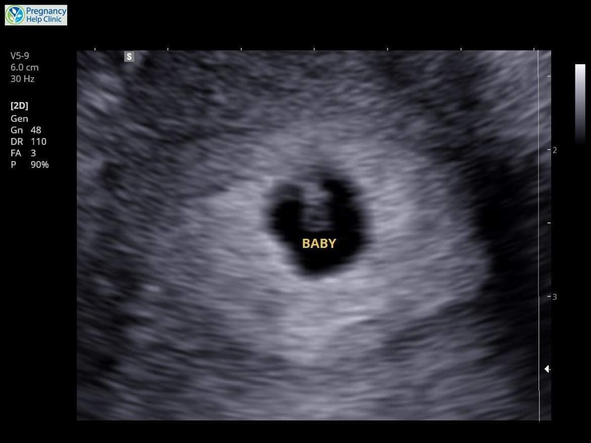
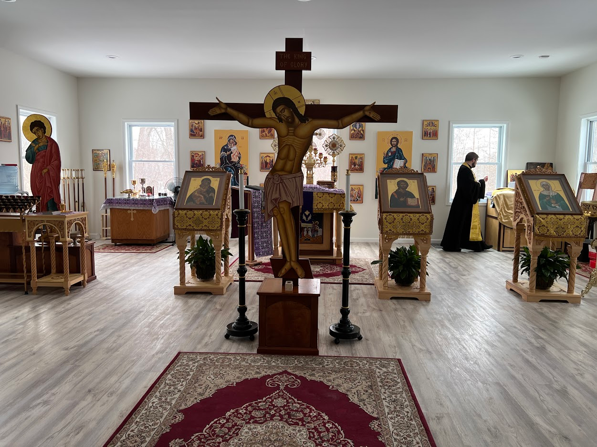

{}Some mood-setting, if you'd like.{}

On the morning of Sunday, January 15th, 2023, my wife did a pregnancy test. The first one she'd ever done, and the result was an *incredibly* faint line indicating pregnant. We weren't sure whether to accept that it was true or if something just was off about this particular test. Accepting meant bringing on all the excitement and anxieties that hit knowing you're about to bring your first child to the world, the alternative was everything remaining the same.

We knew these things were sensitive but a test being a false-positive (especially for something so faint, right?) was possible too, so we showed it to our priest's wife, a labor and delivery nurse. From her eyes, it was definitely pregnant, and thus began the rush of excitement. We wanted children, but were leaving the opportunity to chance, and the dice roll finally landed in favor of that. We made an appointment with a nearby free pregnancy clinic, since there was a slight bureaucratic delay in her getting put on my insurance.

A little over a week later, we attended the appointment. Nothing too eventful occurred. Filling out forms and having another pregnancy test done, confirming what our priest's wife said, pregnant. We received a piece of paper from the doctor certifying that she was pregnant and another appointment was scheduled the following week for our first ultrasound.

{}At this point, Babbyphim was at 6 weeks, 6 days in gestation.{}

By this time, we got the insurance red-tape sorted out, so a proper prenatal care situation was on the horizon for us. We attended the ultrasound, which for both of us (certainly myself) was easily one of the best first experiences we've ever had. A baby was there! We did that! But, there was a hiccup. Babbyphim's heart rate was measuring at 84bpm. Of course, we didn't exactly know what that meant. What we were told was that it should be somewhere around 100bpm. We were quite ignorant of it all, but we knew we needed to get scheduled with a OB/GYN moving forward anyway. This just changed how urgently we needed to get in. We were still quite optimistic, in our ignorant bliss, but the doctor was fairly pensive about it, giving us her condolences.

We had our first ultrasound with the OB/GYN scheduled the following week, but one of the nights before the appointment, I looked up what it meant for your 6-weeks-in-the-womb child to have a lower heart rate. Internet health diagnostic reliability aside, the prognosis wasn't good, but I kept it to myself. Odds are just odds, and "likely" doesn't mean "inevitable." We went to the appointment and not much changed, just monitoring the situation. Such was the case of the appointment the following week. No improvement in either situation, slight glimmers of "okay, maybe there's a chance," but the case was still the same. Babbyphim simply wasn't having a heart rate sufficient enough to indicate they were developing on-pace, in fact they never grew in measurements past what was expected for a fetus 7 weeks in gestation.

But the following week, approx. 9 and a half weeks in gestation on February 21st, it was different. We did the ultrasound, the usual measurements (they had apparently grown ever slightly) and so on, but the ultrasound operator wasn't mentioning to us much of anything this time around. It was fairly indicative what had happened. Babbyphim lost their heartbeat.

As stoic as a family could be knowing their first child-to-be has reposed, we went back to the waiting room while we waited to speak with the doctor. In that time, we decided we would look up patrons and names for our reposed child, checking the saints who were commemorated around this time. I don't recall any of them particularly gleaning out in any sort of way, but my wife had stumbled upon St. Agathon, wonderworker of the Kiev Caves, commemorated the day prior. Not much is known of him (at least on the [OCA's hagiography](https://www.oca.org/saints/lives/2025/02/20/100570-venerable-agathon-wonderworker-of-the-kiev-caves)), but one of the few details is that he foretold of his own death. My wife thought it was fitting for Babbyphim, and Agathon carries a feminine variant, so we decided to name him Agathon.

{}Agathon's gender was still unclear at this point, from the decision onward we decided to consider him male given the patron.{}

We spoke with the doctor and opted for a medication-induced miscarriage that we were able to do at home, with misoprostol and mifepristone, something that we are thankful we were able to have available to us. We spent the rest of the day coping with what we had learned. I picked up the medication that evening.





The following day, in the morning, my wife made a casket for our first child. Around noon, she took the medication. We didn't know how this would all work, so we spent the day on the bed. The experience for her was worse than labor for a fully-gestated child (of course, she had an epidural with Mary). She was cramping the entire day, with persistent contractions from 4pm onward, dealing with morning sickness twice. Some false alarms aside, at 8:49pm, the remains of Agathon, the firstfruits of our marriage, emerged. We placed his remains in the casket, and sat it on our icon corner with a candle lit for a couple days, when we had the miscarriage service done at church.

Later that day, February 24th, Agathon was buried. I had the honor, or lack thereof, of burying our child, something that no father should have to ever encounter. 40 days later, we had the proper memorial service with some close friends.

Up until now only a handful of people have known the entire story, but today it is released.

---

There is something befitting of the firstfruits of our marriage being the one that goes to be with God before life has even substantially begun. Throughout Scripture we hear of dedicating the firstfruits of any labor to God. Sure, we did not have much choice, but it is one of the consolations I've had with this whole experience. We gained an intercessor. Did we need another? There is no sense to this kind of question.

I wear the experiences of the miscarriage as a badge, even more so before Mary was born. Despite what had happened, I was a father. My son just happened to complete his earthly journey significantly sooner than many others. I have the assurance that he is with God, a certainty that many parents can only hope for their children when it comes their time. In some sense, it was a badge of endurance. I *did* bury my child, with all the pain and contradiction that it carries. That is mine, and no one can deprive me of it.

We were quite sorrowful for the months following the miscarriage. Lent started that year mere days after Agathon was buried, which is not a great juxtaposition to have. Between fasting rules and grief, I ate fairly little in comparison to my normal. I lost around somewhere between 30-40 pounds by the end of the season. I spent much of it reading [*Naming the Child: Hope-Filled Reflections on Miscarriage, Stillbirth and Infant Death* by Jenny Schroedel](https://www.goodreads.com/en/book/show/6372029-naming-the-child) and [*Memory Eternal: Living with Grief as Orthodox Christians* by Sarah Myrne-Martelli](https://www.goodreads.com/book/show/62065438-memory-eternal), both valuable books on miscarriage from Orthodox authors. I found them good, but not effectuating much of anything in a personal sense. I knew what I was going through, I knew how to best give Agathon the position in my life that he needs, but at the very least it was helpful reading the anecdotes of others who had experienced what we had, some of whom in even worse situations.

Despite all this, these are not what I would consider the greatest pains of the whole series. They hurt, certainly, in ways that even today I cannot rightfully articulate. Yet, the greatest wound I suffered from my experience was that fathers are treated secondary to the whole situation. Sure, we live in an age where the archetypal man is a stoic hero, who doesn't afraid of anything (forgive my slight meme references), who eats suffering like a microwaveable snack. The archetypal man, who warrants the creation of hospital billboards that say "75% of men die of stubbornness" (from lack of willingness to address health concerns), the pinnacle of creation. Heck, for many families a father is just someone involved in the childmaking process, something that I'm quite familiar with myself. But for all of this comes a sort of compartmentalization of fathers, which I've encountered both in Agathon's miscarriage and in my experiences as Mary's father.

Saving the latter experiences for another time, the deepest pain of the miscarriage was that my grief was secondary. Not by my wife or by close family, and none of this to suggest that any sort of concern for my wife during this time was unjustified or needless. The reality was that, when many would ask me in the following days how my wife was handling the situation, no one raised the question of whether *I* was okay. Whether *I* was feeling stable, fettered or otherwise with the loss of my first son.

Maybe the association of men with mental repress—I mean, *stability*—runs too deep in the common consciousness, maybe I did a damn good (yet unintentional) job of exemplifying that, maybe it's something else entirely. Whatever the case, I was unheard, unobserved, and even to this day have remained largely unseen by what I had to endure. I don't blame anyone for being oblivious or simply not having it occur to them, and maybe it's selfish of me to have wanted (want?) this.

I don't write this as an indictment to any close friends or family or whoever in my sphere that reads this, I hold no personal qualms with anyone about it. I just wonder how different life might have been after this if I too was given hugs, if I too was told that everything would be okay by someone other than my own sense of reason, if I too received flowers expressing condolences.

Instead, I was given nothing. Some surface-level condolences, at worst something along the lines of "I told you not to announce the pregnancy early" (if I may indict one person who I'll leave unnamed). The difficulty shifts beyond the struggle between loss and isolation and into the perception of what it means for me to be vulnerable. After all, this proves that maybe I ought not to be. That doing so is a detraction from the imposed goal of being the archetypal man, which, again, I see less as a deliberate imposition and more something that our society has considered a default. No one is judging me by this standard, I'm certain, but the logical conclusions of these inactions entail that I repress the traumas and difficulties that eat at me. Survival mechanism, and I am confident that I am not the first nor the last.

I don't know if it's been too long after the fact for any sort of different outcome to be a possibility. Maybe it has, it's been something I've had to keep largely to myself. I won't consider the possibility of change to be a missed opportunity, but I can't say I can perceive it or glean how it may happen. The damage has been done, the conclusions (however erroneous) have been made, and much of me feels that I still do not have the context I need where I would feel okay with just letting it all out. This article is an exception, I can be semi-detached from emotions here.

I don't know if I'll have a reasonable, in-person avenue of being truly vulnerable and emotionally transparent about these struggles and others. This whole experience has led me to believe that it takes a very specific sort of person where I'd feel comfortable sharing that with, a person I have not encountered to date. At the very least, I *can* glean what this should look like, but it's merely an ideal for now.

Maybe someday.

{}Don't worry, my wife is aware of these struggles from the moment it started and has been very supportive through all of it.{}

Anyway, I have no real conclusion to offer about all this. Miscarriage sucks, but suffering grief in isolation is even worse. If you know about a family going through miscarriage, be sure to give the dad a hug also, if only because I asked you to. Grief is different for everyone, some dadfriends I know have gone through miscarriages without much reaction at all—not out of apathy, but just from it simply feeling intangible in their minds, but for myself, well, you have the story.

If you're a dad going through the grief of miscarriage, or one appears on the horizon, don't be afraid to reach out to me. My contact info is in my About page, email and Discord will give you the best response times.

Please pray for me, that I might be able to heal from all this, and that maybe writing this will turn some gears toward that.
